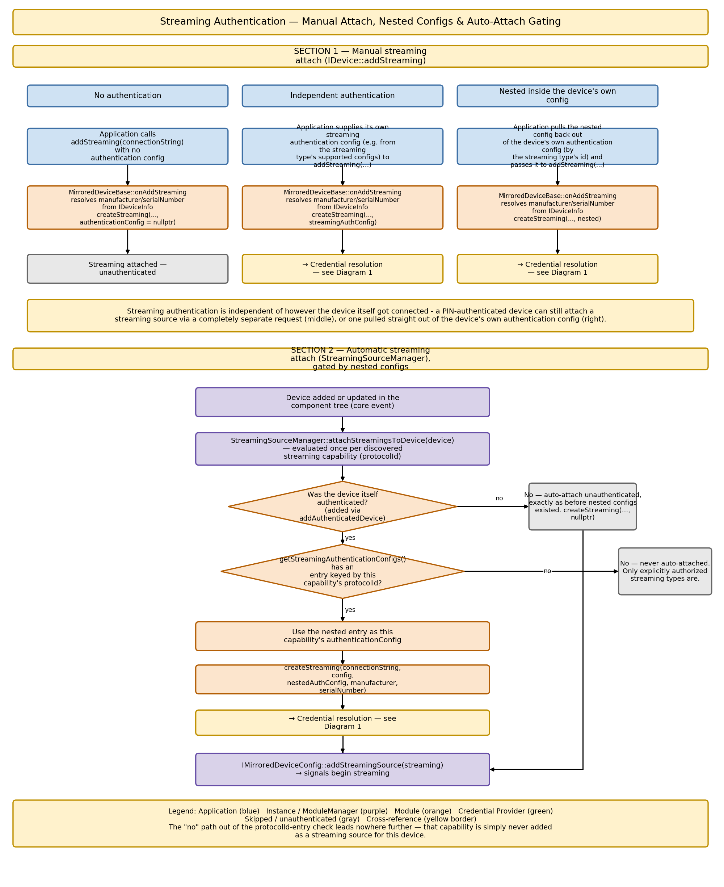
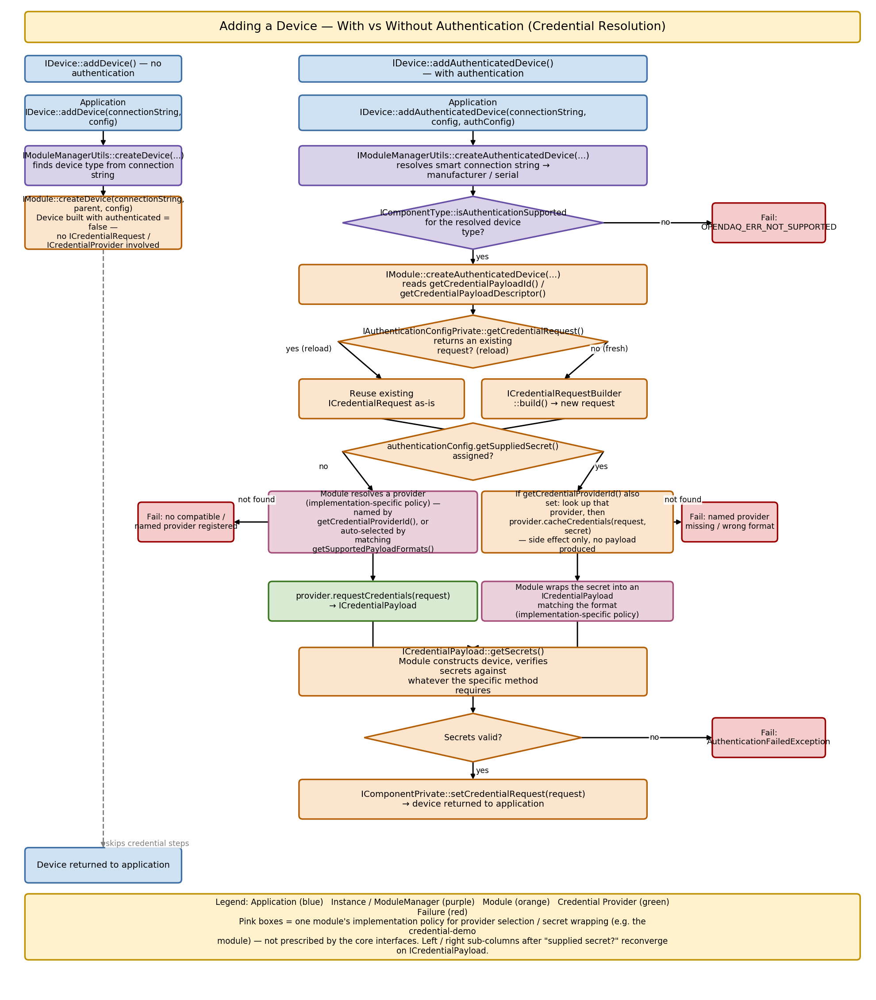
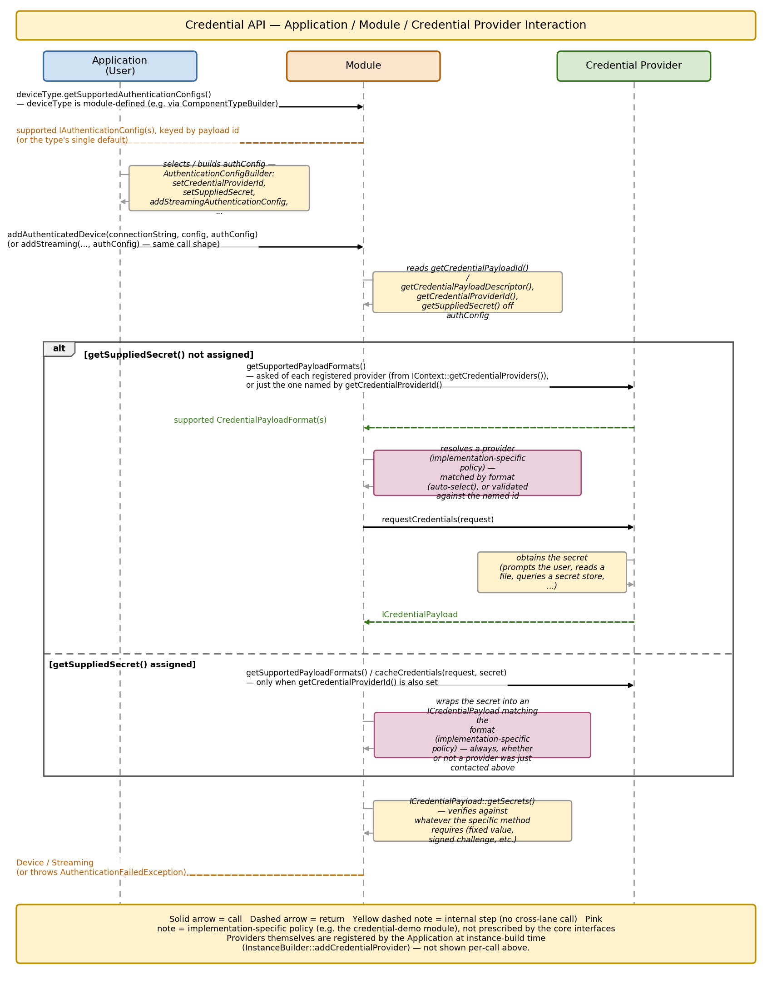

# Credential Provider Framework — API Reference & Authentication Flow

Credentials are modelled by their **format** (`CredentialFormat`: `None`, `KeyValuePairs`, `String`, or `FilePath`) and a **credential descriptor** (`ICredentialDescriptor`) carrying format-specific parameters and a human description. Authentication method selection happens through an `IAuthenticationConfig` object - a single, self-contained property object a device hands back via `IDevice::createDefaultAuthenticationConfig(typeId)`, listing every method the named component type's module declares supporting as a candidate the caller selects among directly, tunes, and hands to `addAuthenticatedDevice`/`addStreaming`. Building it through `IDevice` (rather than the component type directly) gives it access to the device's `Context`, so it can also offer registered credential providers as a `"CredentialProviderId"` selection - a live selection that depends on the selected method, re-filtered from `Context` to only the providers currently supporting that method's format every time the selection changes.

---

## 1. Core Interfaces

### `ICredentialDescriptor`

Describes the shape and presentation of the secret(s) an authentication method expects.

| Member | Description |
|---|---|
| `getAuthenticationMethodId(IString**)` | The id that uniquely identifies this authentication method at least within the module that offers it - the same id the module declares as its default, and that a caller matches against when selecting this method out of an `IAuthenticationConfig`'s `"AuthenticationMethod"` candidates (see below). In practice often unique system-wide instead: the `Standard*CredentialDescriptor` factories key off shared, well-known ids and resolve their Struct/secret class from the one `ITypeManager` shared by the whole `Context`, so different modules using the same standard id (and the same `Context`) produce identically-shaped descriptors, reusing the id deliberately rather than colliding by accident. |
| `getFormat(CredentialFormat*)` | The described secret(s)' format — `None`, `KeyValuePairs`, `String`, or `FilePath`. |
| `getParameters(IStruct**)` | The format's standard parameter set, as a Struct whose own Struct type is pinned to the format - for `KeyValuePairs`, a `"Keys"` dict field mapping each expected key to a hidden flag (e.g. `{"UserName": False, "Password": True}`); for `String`, a single `"Hidden"` bool field. A `FilePath`-format descriptor has no format-specific parameters - `getParameters()` returns an unassigned `IStruct`. A `None`-format descriptor likewise has no parameters, there being nothing to describe. |
| `getDescription(IString**)` | Human-readable description of the authentication method, e.g. *"PIN-code"*, *"username and password"*, *"Path to the SSH private key file"*. |
| `createEmptySecret(IPropertyObject**)` | Builds an empty secret matching this format: a property object with one empty (default `""`) String property per secret value expected - one per key named in `getParameters()`'s `"Keys"` dict for `KeyValuePairs` (e.g. `"UserName"`, `"Password"`), or a single property for `String`/`FilePath`, named and described by the descriptor's own registered secret class (e.g. `"Pin"`, `"PrivateKeyFilePath"`). Meant to be filled in with the actual secret value(s) and used as the credential itself - see [§5](#5-credential-provider-selection--supplied-secrets). Not supported for `None` - a `None`-format authentication method requires no credentials at all, so no secret is ever needed for it in the first place; therefore returns `OPENDAQ_ERR_NOT_SUPPORTED`. |

**Factories:** `KeyValueDescriptor(id, keys, description, typeManager, secretClassName)`, `StringDescriptor(id, description, hidden, typeManager, secretClassName)`, `FilePathDescriptor(id, description, typeManager, secretClassName)`, `NoneDescriptor(id, description, typeManager)` - `typeManager` must already have the format's struct type registered, and (for every format but `None`, which has no secret class at all) `secretClassName` must already be a registered `IPropertyObjectClass` that `createEmptySecret()` builds the returned secret from; these throw otherwise. `Context` registers all four formats' struct types up front (`RegisterCredentialDescriptorTypes`, called from `ContextImpl::registerOpenDaqTypes`), so any descriptor built with a real `Context`'s type manager already satisfies the struct-type half of this.

**Standard descriptors:** `StandardUserNamePasswordCredentialDescriptor(typeManager)`, `StandardPinCredentialDescriptor(typeManager)`, `StandardPrivateKeyFileCredentialDescriptor(typeManager)`, and `StandardAnonymousCredentialDescriptor(typeManager)` build ready-made descriptors for four well-known methods, each keyed by its own well-known id (`StandardUserNamePasswordId` = `"UserNamePassword"`, `StandardPinId` = `"Pin"`, `StandardPrivateKeyFileId` = `"PrivateKeyFile"`, `StandardAnonymousId` = `"Anonymous"`) and, for the three that need one, its own registered `IPropertyObjectClass` (`UserNamePasswordCredentialSecretClass`, `PinCredentialSecretClass`, `PrivateKeyFileCredentialSecretClass` - all registered by `RegisterCredentialDescriptorTypes` alongside the struct types above) - so every module offering one of these methods produces the exact same descriptor and secret shape, rather than each inventing its own.

```cpp
enum class CredentialFormat : EnumType
{
    None = 0,       // no secret(s) at all — typically anonymous access, nothing to supply or verify
    KeyValuePairs,  // N string pairs — e.g. UserName / Password
    String,         // one string — token, API key, PIN
    FilePath        // one string — path to a file containing the secret, e.g. a private key
};
```

---

### `IAuthenticationConfig`

Carries the authentication settings for a single connection attempt. Lives alongside the base add-component config, never serialized as part of it - though a component created with authentication may persist a reduced form of the config it was authenticated with alongside itself instead (see [Serialization](#serialization) below and [§7](#7-application-level-usage)).

`IAuthenticationConfig` extends `IPropertyObject` - the settings below are backed by ordinary properties, so besides the typed getters, they can equally be read and set through the generic `IPropertyObject` interface:

| Property | Description |
|---|---|
| `"AuthenticationMethod"` (Selection, drives `"CredentialProviderId"`'s candidates) | The authentication method id and its corresponding credential descriptor, bound together as one property so they can never be set out of sync: its selection value is the `ICredentialDescriptor` Struct itself, and the authentication method id is simply that Struct's own `getAuthenticationMethodId()`. A config returned by `IDevice::createDefaultAuthenticationConfig(typeId)` (see [§2](#2-extensions-to-existing-interfaces)) is self-contained - every authentication method the component type supports is a selection candidate here, not just one - so the caller switches methods by changing this property's selection, without fetching a different config object. Changing this property live-recomputes `"CredentialProviderId"` (see below) and may clear an incompatible `"SuppliedSecret"`. |
| `"CredentialProviderId"` (Selection, conditional - depends on `"AuthenticationMethod"`) | The id of the credential provider to request credentials from - a Selection re-queried from `Context::getCredentialProviders()`, recomputed fresh (never a cached snapshot) every time `"AuthenticationMethod"` changes, defaulting to the first compatible provider (the caller can select a different compatible one instead). Absent when no registered provider currently supports the *selected* `"AuthenticationMethod"`'s format - the module never chooses a provider on its own at request time, it only ever consumes whichever id this property currently selects, so its absence simply means authentication fails outright (see [§8](#8-module-level-implementation)). |
| `"SuppliedSecret"` (Object, optional) | A secret supplied directly by the caller, to be used instead of a provider obtaining it. Present only when one was actually supplied — check with `hasProperty("SuppliedSecret")`, or via `getSuppliedSecret()` below — since an Object-type property cannot itself hold `nullptr`. Every write is validated against the *currently selected* `"AuthenticationMethod"`: the object's property names must match `descriptor.createEmptySecret()`'s exactly (build from that template, fill it in, submit it - the blessed workflow), or the write is rejected. An `"AuthenticationMethod"` change that leaves an already-set `"SuppliedSecret"` incompatible with the new selection silently clears it. See [§5](#5-credential-provider-selection--supplied-secrets). |

| Member | Description |
|---|---|
| `getAuthenticationMethodId(IString**)` | Convenience getter for the selected `"AuthenticationMethod"` value's own id. |
| `getCredentialDescriptor(ICredentialDescriptor**)` | Convenience getter for the `"AuthenticationMethod"` property's current selection value. |
| `getCredentialProviderId(IString**)` | Convenience getter for the `"CredentialProviderId"` property's selected value, or `nullptr` if the property is absent entirely. |
| `getSuppliedSecret(IPropertyObject**)` | Convenience getter for the `"SuppliedSecret"` property's value, or `nullptr` if the property is absent entirely. |

There is no "additional config" on `IAuthenticationConfig` itself - settings like whether to hide secret input as it's typed travel via the component's own, generic config object instead (the same one `addDevice`/`addStreaming` always take), read by the module from its own `config` parameter alongside the authentication config.

**Factory:** `AuthenticationConfig(credentialDescriptors, defaultAuthenticationMethodId, context, typeId)` — builds a config supporting every authentication method described in `credentialDescriptors` (a dict keyed by each descriptor's own id). Each entry becomes one candidate value of the resulting config's `"AuthenticationMethod"` Selection property, so a caller can later switch between methods just by changing that property's selection instead of needing a different config object per method; `defaultAuthenticationMethodId` names which entry starts out selected. A single-method config is just the one-entry case of this - pass a `credentialDescriptors` dict with a single key/value pair; there's no separate single-descriptor factory, since it would add nothing this one doesn't already cover. `context` must be assigned - throws otherwise - and drives the live `"CredentialProviderId"` filtering described above. `typeId` has no default instead: every caller states explicitly whether it has one, `nullptr` included; it's carried through [serialization](#serialization) so a reload can re-resolve everything fresh (`nullptr` ⇒ the built config has no type behind it and can't meaningfully round-trip through save/reload). `"CredentialProviderId"` and `"SuppliedSecret"` are never set by the factory - set them afterward via those properties directly, the same way regardless of who built the config. This is what `IDevice::createDefaultAuthenticationConfig(typeId)` uses internally to build its self-contained, every-method config.

**Serialization:** fully custom, not the generic `IPropertyObject` mechanism. The component type id (as supplied by `IDevice::createDefaultAuthenticationConfig`), the selected `"AuthenticationMethod"`'s authentication method id, and - when present - the selected `"CredentialProviderId"` are written; `"SuppliedSecret"` (a secret) is never serialized. Deserializing re-resolves the saved type id against the live `Context` (device types, then streaming types) and rebuilds the config fresh, selecting the *saved* authentication method id - it fails outright if the type no longer resolves, or the saved id is no longer among that type's currently supported descriptors. The saved provider id is then restored only if it's still among the freshly-rebuilt `"CredentialProviderId"` candidates; otherwise the normal live default (first compatible provider) applies, the same as for a config with no saved provider id at all. A config built with `typeId = nullptr` has no type id to save and so cannot meaningfully round-trip this way.

---

### `ICredentialRequest`

Carries the non-secret details of a credential request, handed to `ICredentialProvider::requestCredentials`/`cacheCredentials`. Built via `ICredentialRequestBuilder`. Never carries actual secrets.

| Member | Description |
|---|---|
| `getComponentType(IComponentType**)` | The type of component the request is for. |
| `getConnectionString(IString**)` | The *canonical* connection string of this connection attempt - already resolved via the owning module's `onGetCanonicalConnectionString` (routing prefix trimmed, every parameter made explicit), not necessarily the raw string the caller originally supplied. |
| `getMetaData(IPropertyObject**)` | Additional metadata for the provider to present to the user. Optional - empty (no properties) if the caller added none. |
| `getManufacturer(IString**)` | The manufacturer of the device the connection is being established to or for - a request can be for a direct connection to that device, or for a streaming connection attached to it. Optional - unassigned if not known for this connection. |
| `getSerialNumber(IString**)` | The serial number of the device the connection is being established to or for - a request can be for a direct connection to that device, or for a streaming connection attached to it. Optional - unassigned if not known for this connection. |
| `getDescriptor(ICredentialDescriptor**)` | The credential descriptor the provider must provide a secret for, read from `IAuthenticationConfig` when the request was built. Its own id names the negotiated authentication method. |

**Why canonical?** A provider identifies which connection a request belongs to primarily by `(manufacturer, serialNumber)` - e.g. `CmdLineCredentialProvider`'s in-session `FilePath` caching (see [§5](#5-credential-provider-selection--supplied-secrets)). When neither is available, a provider falls back to the connection string itself as the identifying key instead - which only works reliably if it's canonical, so the same connection always identifies itself the same way no matter how the caller originally wrote it.

**Factory:** `CredentialRequestFromBuilder(builder)` — hidden factory, built from a `ICredentialRequestBuilder`.

---

### `ICredentialRequestBuilder`

Builds `ICredentialRequest` objects.

| Member | Description |
|---|---|
| `build(ICredentialRequest**)` | Builds and returns a `CredentialRequest` from the currently configured values. Fails if `componentType`, `connectionString`, or `descriptor` was never set. |
| `setComponentType` / `getComponentType` | The component type the request is being built for. Required. |
| `setConnectionString` / `getConnectionString` | The *canonical* connection string for this attempt - expected to already be resolved via `onGetCanonicalConnectionString` before being set here. Required. |
| `setManufacturer` / `getManufacturer` | The manufacturer of the device the connection is being established to or for - a request can be for a direct connection to that device, or for a streaming connection attached to it. Optional - leave unset if not known. |
| `setSerialNumber` / `getSerialNumber` | The serial number of the device the connection is being established to or for - a request can be for a direct connection to that device, or for a streaming connection attached to it. Optional - leave unset if not known. |
| `addMetaDataProperty(IProperty*)` | Adds a metadata property, for the provider to present to the user. Optional - the built request's metadata is simply empty if never called. |
| `getMetaData(IPropertyObject**)` | The accumulated metadata property object. |
| `setDescriptor` / `getDescriptor` | The credential descriptor the provider must supply a secret for - typically read from `IAuthenticationConfig` when the request is built. Its own id names the negotiated authentication method. Required. |

**Factory:** `CredentialRequestBuilder()`

---

### Credentials

There is no dedicated credential interface - a credential is simply an `IPropertyObject`, built from the credential descriptor's `createEmptySecret()` template and filled in with the actual secret value(s). For a `KeyValuePairs`-format method it has one String property per key (e.g. `"UserName"`, `"Password"`); for `String`/`FilePath` it has a single String property, named and described by the descriptor's own registered secret class (e.g. `"Pin"`, `"PrivateKeyFilePath"`). Both a credential provider's `requestCredentials` and a caller directly supplying a secret (`IAuthenticationConfig`'s `"SuppliedSecret"` property) produce/consume this exact same shape - see [§5](#5-credential-provider-selection--supplied-secrets).

A `None`-format method needs no credentials at all - no `createEmptySecret()` template, no `"SuppliedSecret"`, and no credential provider ever consulted for it (see [§8](#8-module-level-implementation)); selecting `"AuthenticationMethod"` to a `None`-format descriptor is the entire authentication step.

---

### `ICredentialProvider`

Supplies the secrets requested via an `ICredentialRequest` — by prompting the user, reading a file, or fetching from a secret store.

| Member | Description |
|---|---|
| `getId(IString**)` | The provider's id. |
| `requestCredentials(ICredentialRequest*, IPropertyObject**)` | Requests credentials for the given request, in the format described by its credential descriptor — obtaining them interactively (prompting, reading a file, etc.) unless a cached value from an earlier `cacheCredentials`/`requestCredentials` call for the same context already covers it. Returns a property object built from the descriptor's `createEmptySecret` template, filled in with the obtained secret(s). |
| `cacheCredentials(ICredentialRequest*, IPropertyObject* secret)` | Accepts a secret already known in advance (see `IAuthenticationConfig`'s `"SuppliedSecret"` property), shaped like the request's credential descriptor's `createEmptySecret` template, so an implementation that would otherwise cache a value obtained interactively caches this one the same way — a later `requestCredentials` call for the same context then reuses it instead of prompting. Produces nothing itself; the caller already has the secret and uses it directly. Implementations for which caching doesn't apply (or doesn't apply to the request's format) may treat this as a no-op. |
| `getSupportedFormats(IList**)` | The list of `CredentialFormat` values this provider can supply — used for format-matching against a device type's supported formats. Should never include `None` - there is nothing for a provider to supply for it; `Module` resolves a `None`-format request entirely on its own, without ever consulting a provider (see [§8](#8-module-level-implementation)). |

**Factories:**
- `CmdLineCredentialProvider()` — prompts the user for secrets via the command line. Caches `FilePath`-format secrets in-memory for its own lifetime (i.e. for the active session), keyed by `(manufacturer, serialNumber)` — a second interactive request for the same device and format reuses the path already entered (or supplied via `cacheCredentials`) instead of prompting again. `String`/`KeyValuePairs` secrets are never cached.
- `FileCredentialProvider()` — dedicated to file-backed secrets. Prompts for the file's path via the command line, the same way `CmdLineCredentialProvider` does, and hands back the path itself for a `FilePath`-format request. Retries the path prompt up to 3 times if the given path isn't accessible, then fails authentication. Never caches anything — `cacheCredentials` is a no-op.

---

## 2. Extensions to Existing Interfaces

Component types (`IComponentType` and everything derived from it, including `IDeviceType`/`IStreamingType`) carry no authentication data themselves - they're Struct-convertible, and attaching authentication data to them would break that conversion. A module that wants a device or streaming type to support authentication instead declares the supported credential descriptors and the default one internally, keyed by that type's own id - not through any public interface.

### `IDevice`

| New member | Description |
|---|---|
| `createDefaultAuthenticationConfig(IString* typeId, IAuthenticationConfig**)` | Builds and returns a new, self-contained authentication config for one of this device's own available device or streaming types, named by `typeId` (looked up among the device's available device types, then its available streaming types) - not for the device itself, which this method has no bearing on. A new object is returned on each call, same as `createDefaultConfig`. See `IAuthenticationConfig` ([§1](#1-core-interfaces)) for what it contains and how to tune it. Returns `OPENDAQ_ERR_NOTFOUND` if `typeId` names neither an available device type nor an available streaming type. |
| `addAuthenticatedDevice(IDevice**, IString* connectionString, IPropertyObject* config = nullptr, IAuthenticationConfig* authenticationConfig = nullptr)` | Connects to a device using the given authentication configuration. |
| `addStreaming(IStreaming**, IString* connectionString, IPropertyObject* config = nullptr, IAuthenticationConfig* authenticationConfig = nullptr)` | Attaches a streaming connection, optionally authenticated — a `nullptr` config (the default) uses the plain, unauthenticated path. See [§4](#4-streaming-authentication). |

### `IModuleManagerUtils`

| New member | Description |
|---|---|
| `createAuthenticatedDevice(IDevice**, IString* connectionString, IComponent* parent, IPropertyObject* config, IAuthenticationConfig* authenticationConfig)` | Iterates loaded modules, creating a device with the first one accepting the connection string and supporting authentication. Manufacturer/serial number are resolved from discovery info only for smart (`daq://`) connection strings; otherwise left unset. |
| `createStreaming(IStreaming**, IString* connectionString, IPropertyObject* config = nullptr, IAuthenticationConfig* authenticationConfig = nullptr, IString* manufacturer = nullptr, IString* serialNumber = nullptr)` | Iterates loaded modules, creating a streaming connection with the first one accepting the connection string. Unlike `createAuthenticatedDevice`, there is no smart-string/discovery resolution here — streaming connection strings are always concrete, protocol-specific ones — so `manufacturer`/`serialNumber` are simply forwarded as given. |

### `IModule`

| New member | Description |
|---|---|
| `createAuthenticatedDevice(IDevice**, IString* connectionString, IString* manufacturer, IString* serialNumber, IComponent* parent, IPropertyObject* config, IAuthenticationConfig* authenticationConfig)` | Module-level counterpart — receives manufacturer/serial resolved by the module manager, in addition to the authentication config. |
| `createStreaming(IStreaming**, IString* connectionString, IPropertyObject* config, IAuthenticationConfig* authenticationConfig, IString* manufacturer, IString* serialNumber)` | Module-level counterpart of `IModuleManagerUtils::createStreaming`. |

### `IInstanceBuilder`

| New member | Description |
|---|---|
| `getCredentialProviders(IDict**)` | The registered providers, keyed by id. |
| `addCredentialProvider(IString* providerId, ICredentialProvider*)` | Registers a provider under a unique id. |

### `IContext`

Extended with an additional `credentialProviders` parameter (`DictPtr<IString, ICredentialProvider>`) on the `Context` factory, and `getCredentialProviders(IDict**)` to retrieve them — providers registered on the instance builder flow through to the context, from which modules resolve them at authentication time.

---

## 3. Two Ways to Add a Device

The device can be added either **without authentication** (the plain, anonymous path) or **with authentication**. Both paths exist side by side — a device type that supports authentication doesn't lose its plain connection option, and the two are chosen simply by which method is called.

### The plain path (no authentication)

```cpp
auto device = instance.addDevice("daq://openDAQ_1234");
```

At the application level, this is a single call — no credential provider needs to be registered, and no authentication config is involved at all.

At the module level, this resolves to `Module::createDevice`. The device is constructed with `authenticated = false`, and the module's own secret-verification step is skipped entirely — no credential, no provider lookup, no challenge or comparison of any kind.

### The authenticated path

```cpp
auto device = instance.addAuthenticatedDevice("daq://openDAQ_1234", nullptr, authenticationConfig);
```

The same connection string is used, but an `IAuthenticationConfig` is supplied, and everything described in the rest of this document — credential negotiation, provider lookup, credential retrieval, verification — is triggered as a result.

A device type only exposes this path meaningfully when its module declares at least one supported authentication method for it (see [§2](#2-extensions-to-existing-interfaces)) - `IDevice::createDefaultAuthenticationConfig(typeId)` fails otherwise, and so does `addAuthenticatedDevice` against such a type.

---

## 4. Streaming Authentication

Attaching a streaming connection is authenticated **independently** of however the device itself got connected — a device authenticated via PIN can have a streaming source attached to it that goes through its own, entirely separate credential request. `IDevice::addStreaming`'s last parameter is the authentication config, exactly mirroring `addAuthenticatedDevice`: a `nullptr` config uses the plain, unauthenticated path; a supplied one triggers the same provider-lookup/credential-request machinery described for devices.

```cpp
// Plain, unauthenticated streaming attach:
device.addStreaming("daq.credential_demo_streaming://credential_demo_device");

// Authenticated streaming attach, with its own independent authentication config:
auto streamingAuthConfig = instance.createDefaultAuthenticationConfig(streamingType.getId());
SelectAuthenticationMethod(streamingAuthConfig, "PrivateKeyFile"); // see §7 - switches the selection generically
device.addStreaming("daq.credential_demo_streaming://credential_demo_device", nullptr, streamingAuthConfig);
```

### Auto-attach is always unauthenticated

`StreamingSourceManager` (the implementation behind the `PrioritizedStreamingProtocols`/`AutomaticallyConnectStreaming` add-device config) auto-attaches streaming sources for a device once it's added, always via the plain, unauthenticated path — regardless of whether the device itself was authenticated (`addAuthenticatedDevice`) or not. A streaming source that needs authentication must be attached manually, via `addStreaming`'s own authentication config parameter, as shown above.


*Diagram 2 — manual `addStreaming` (unauthenticated or independently authenticated), and `StreamingSourceManager`'s always-unauthenticated auto-attach. The authenticated manual path hands off to the same credential resolution shown in Diagram 1 ([§6](#6-authentication-flow)).*

---

## 5. Credential Provider Selection & Supplied Secrets

Two independent, combinable settings on `IAuthenticationConfig` let a caller take over parts of the credential-provider machinery that would otherwise happen automatically - both set directly on the config as plain properties (`IAuthenticationConfig` is itself a property object).

### Explicit provider selection

The module itself never chooses a provider - at request time, it only ever asks whichever provider id `"CredentialProviderId"` currently selects (see `IAuthenticationConfig`'s docs in [§1](#1-core-interfaces)), and fails outright if that's absent. All the "choosing" already happened earlier, in the config's own live `"CredentialProviderId"` Selection: by default it points at the first provider compatible with the currently selected `"AuthenticationMethod"`, but the caller can select a different compatible one instead - `setPropertySelectionValue`/`getPropertySelectionValue` work directly on any `IAuthenticationConfig` instance, including the self-contained one `IDevice::createDefaultAuthenticationConfig(typeId)` returns (a new, independent object on every call - safe to mutate directly, nothing else shares it), as long as it currently has a `"CredentialProviderId"` property - which it does whenever at least one registered provider supports the *currently selected* method's format:

```cpp
auto config = instance.createDefaultAuthenticationConfig(deviceType.getId());
SelectAuthenticationMethod(config, "PrivateKeyFile"); // see §7 for this helper
config.setPropertySelectionValue("CredentialProviderId", cmdLineCredentialProvider.getId());
std::cout << config.getPropertySelectionValue("CredentialProviderId") << std::endl;
```

This only makes an observable difference for a format more than one registered provider supports — e.g. `FilePath`, supported by both `FileCredentialProvider` and `CmdLineCredentialProvider`. Since `"CredentialProviderId"`'s own candidates are always pre-filtered to compatible providers, there is no way to select one that's unregistered or format-incompatible through this property at all - the module-level check for that (see [§8](#8-module-level-implementation)) is defensive-only, not something an application-level selection can trigger.

### Supplying the secret directly

Setting `"SuppliedSecret"` hands the module a secret it already has — a property object built from the config's credential descriptor's `createEmptySecret()` template and filled in with the actual value(s) — instead of having a provider obtain one interactively. The write is validated against the *currently selected* `"AuthenticationMethod"` (see [§1](#1-core-interfaces)), so select the method first:

```cpp
auto config = instance.createDefaultAuthenticationConfig(deviceType.getId()); // UserNamePassword is the default method

auto secret = config.getCredentialDescriptor().createEmptySecret();
secret.setPropertyValue("UserName", "user");
secret.setPropertyValue("Password", "pass");
config.setPropertyValue("SuppliedSecret", secret);

auto device = instance.addAuthenticatedDevice("daq://openDAQ_1234", nullptr, config);
```

- **No provider id set:** no provider is looked up at all — the module uses the supplied secret directly and authenticates with it, with no prompt of any kind.
- **A provider id is also set:** the module still uses the supplied secret directly for this connection, but first hands both it and the credential request to that specific provider via `ICredentialProvider::cacheCredentials`, so the provider can remember it the same way it would one obtained interactively.

The second combination is what makes it possible for a *later*, ordinary `requestCredentials` call — e.g. authenticating a streaming connection attached to the same device — to be served from the provider's cache instead of prompting, provided the provider actually caches for that format (see `CmdLineCredentialProvider`'s `FilePath` caching) and the two requests share the same `(manufacturer, serialNumber)`:

```cpp
auto deviceConfig = instance.createDefaultAuthenticationConfig(deviceType.getId());
SelectAuthenticationMethod(deviceConfig, "PrivateKeyFile");
deviceConfig.setPropertySelectionValue("CredentialProviderId", cmdLineCredentialProvider.getId());

auto deviceSecret = deviceConfig.getCredentialDescriptor().createEmptySecret();
deviceSecret.setPropertyValue("PrivateKeyFilePath", "/path/to/private_key.pem");
deviceConfig.setPropertyValue("SuppliedSecret", deviceSecret);

auto device = instance.addAuthenticatedDevice("daq://openDAQ_1234", nullptr, deviceConfig);

// Same device, same FilePath-format method, same provider - no path prompt this time; the provider
// serves it from the cache `cacheCredentials` populated above.
auto streamingConfig = instance.createDefaultAuthenticationConfig(streamingType.getId());
SelectAuthenticationMethod(streamingConfig, "PrivateKeyFile");
streamingConfig.setPropertySelectionValue("CredentialProviderId", cmdLineCredentialProvider.getId());
device.addStreaming("daq.credential_demo_streaming://credential_demo_device", nullptr, streamingConfig);
```

For the credential-demo module specifically, the device's own manufacturer/serial number are what `MirroredDeviceBase::onAddStreaming` resolves (from `IDeviceInfo`) and forwards into the streaming connection attempt, so a manually-attached streaming connection for the same device naturally lands in the same cache bucket.

---

## 6. Authentication Flow

Both ways of adding a device converge on the same entry point at the application level — a connection string and a config object — and diverge based on whether an `IAuthenticationConfig` is supplied.

Without one, the call resolves straight down to the module's plain device-construction path: the module manager locates the appropriate device type from the connection string, and the module builds the device with no further involvement from the credential framework at all.

With one, the module manager first confirms the target device type actually supports authentication, then hands off to the module together with the authentication config. From there, the module works out which credential descriptor it needs, resolves the credentials for it — the provider currently selected in the config's own `"CredentialProviderId"` (the module never chooses one itself, see [§5](#5-credential-provider-selection--supplied-secrets)) obtaining them interactively, or a directly-supplied secret used instead — and obtains a credential request, either reusing one carried over from a previous save (on reload) or building a fresh one. The module then verifies the obtained credentials and constructs the device. Whether the request was fresh or reused, the resulting credential request is stored on the device afterward, so a future reload can repeat this same process rather than needing the original secrets to be saved anywhere.


*Diagram 1 — the plain vs. authenticated add-device paths, and the credential-resolution branching (the config's own currently-selected provider vs. an explicit id override, interactive `requestCredentials` vs. a directly-supplied secret). The same resolution applies verbatim to authenticating a streaming connection (Diagram 2, [§4](#4-streaming-authentication)) — only the surrounding API call differs. The pink steps (consuming the config's own provider selection, secret-wrapping) are `Module`'s own shared base-class implementation (`requestCredentials`/`obtainCredentials`, see [§8](#8-module-level-implementation)) — not something the core interfaces prescribe, but also not something a module supporting authentication needs to reimplement itself.*

---

## 7. Application-Level Usage

### Registering credential providers

```cpp
auto credentialProvider = CmdLineCredentialProvider();

auto instanceBuilder = InstanceBuilder();
instanceBuilder.addCredentialProvider(credentialProvider.getId(), credentialProvider);
auto instance = instanceBuilder.build();
```

Provider registration happens once, at instance-build time, and is **never serialized** — a reloaded instance must register its own providers independently, since provider setup is platform-/host-specific. Multiple providers can be registered; when more than one supports the same format, the first one registered is the one the config's own `"CredentialProviderId"` defaults to selecting (see [§5](#5-credential-provider-selection--supplied-secrets)) - the module itself never re-enumerates them at request time, it only consumes that already-made selection, which the caller can also override to a different compatible provider.

### Selecting an authentication method

`IDevice::createDefaultAuthenticationConfig(typeId)` returns one **self-contained** config listing every method the named device type supports as a candidate of its `"AuthenticationMethod"` selection property (see [§1](#1-core-interfaces)) - not a separate config per method. The application either accepts the type's default selection, or switches it to a different supported method by matching authentication method ids, entirely through plain property object calls:

```cpp
// Selects one of the config's supported methods by authentication method id - manipulating the "AuthenticationMethod"
// selection property directly. No `ICredentialDescriptor` cast needed for the id comparison itself,
// only to read `getAuthenticationMethodId()` off each candidate.
void SelectAuthenticationMethod(const AuthenticationConfigPtr& authConfig, const StringPtr& authenticationMethodId)
{
    ListPtr<IStruct> candidates = authConfig.getProperty("AuthenticationMethod").getSelectionValues();
    for (const auto& candidate : candidates)
    {
        if (candidate.asPtr<ICredentialDescriptor>().getAuthenticationMethodId() == authenticationMethodId)
        {
            authConfig.setPropertySelectionValue("AuthenticationMethod", candidate);
            return;
        }
    }
    throw std::runtime_error("Unknown authentication method id: " + authenticationMethodId.toStdString());
}

auto deviceType = instance.getAvailableDeviceTypes().get("CredentialDemoDevice");

// Use the type's default authentication method:
auto config = instance.createDefaultAuthenticationConfig(deviceType.getId());
auto device = instance.addAuthenticatedDevice("daq://openDAQ_1234", nullptr, config);

// Or explicitly select a specific supported method instead (e.g. "Pin"), on a config of its own:
auto pinConfig = instance.createDefaultAuthenticationConfig(deviceType.getId());
SelectAuthenticationMethod(pinConfig, "Pin");
auto device2 = instance.addAuthenticatedDevice("daq://openDAQ_1234", nullptr, pinConfig);
```

### Example: manipulating the config as a plain property object

`IAuthenticationConfig` extends `IPropertyObject` (see [§1](#1-core-interfaces)), so the application can equally configure and inspect it with plain property object calls instead of the typed getters used elsewhere in this section - `IDevice::createDefaultAuthenticationConfig(typeId)` already returns a fresh, independent, self-contained config, ready to tune directly:

```cpp
auto authConfig = instance.createDefaultAuthenticationConfig(deviceType.getId());
SelectAuthenticationMethod(authConfig, "Pin");

StructPtr credentialDescriptor = authConfig.getPropertySelectionValue("AuthenticationMethod");
std::cout << "Authentication method id: " << credentialDescriptor.get("Id") << std::endl; // "Pin" - no ICredentialDescriptor cast needed

authConfig.setPropertySelectionValue("CredentialProviderId", credentialProvider.getId());
std::cout << "Credential provider id: " << authConfig.getPropertySelectionValue("CredentialProviderId") << std::endl;

auto device = instance.addAuthenticatedDevice("daq://openDAQ_1234", nullptr, authConfig);
```

See `demoAuthenticationConfigAsPropertyObject` in the `credential_providers` example app for the full, runnable version of this.

### Example: private-key challenge authentication

```cpp
auto fileCredentialProvider = FileCredentialProvider();
auto cmdLineCredentialProvider = CmdLineCredentialProvider();

auto instanceBuilder = InstanceBuilder();
// Registered first, so it — not CmdLineCredentialProvider — is picked for FilePath requests.
instanceBuilder.addCredentialProvider(fileCredentialProvider.getId(), fileCredentialProvider);
instanceBuilder.addCredentialProvider(cmdLineCredentialProvider.getId(), cmdLineCredentialProvider);
auto instance = instanceBuilder.build();

auto deviceType = instance.getAvailableDeviceTypes().get("CredentialDemoDevice");

// FilePath variant — module reads and parses the PEM file itself.
auto privateKeyFileConfig = instance.createDefaultAuthenticationConfig(deviceType.getId());
SelectAuthenticationMethod(privateKeyFileConfig, "PrivateKeyFile");
auto device = instance.addAuthenticatedDevice("daq://openDAQ_1234", nullptr, privateKeyFileConfig);
```

See [§4](#4-streaming-authentication) for authenticating a streaming connection and [§5](#5-credential-provider-selection--supplied-secrets) for selecting a specific provider or supplying a secret directly.

### Save and reload

Saving an instance persists the connected device's `AuthenticationConfig` as part of the tree - but only in its reduced, serialized form (see [Serialization](#serialization) in [§1](#1-core-interfaces)): the component type's own id, the selected method's id, and the selected credential provider's id, if any. No secret (supplied or obtained interactively) is ever saved. Reloading that saved configuration into a new instance re-resolves the type against the new instance's own `Context` and rebuilds a fresh, live config selecting the saved method - `"CredentialProviderId"` is filtered exactly as it would be for a brand-new `createDefaultAuthenticationConfig` call, then set to the saved provider id if it's still among the resulting candidates; otherwise it falls back to the same default (first compatible provider) a brand-new call would use. The device then re-authenticates from scratch through the same provider-resolution path a fresh connection would (see [§8](#8-module-level-implementation)): the new instance must have its own compatible credential provider registered, or the reload fails, and that provider is asked for credentials again exactly like it would for a first-time connection - a prompt-free reload only happens if that specific provider itself already has something cached for this context (see `cacheCredentials`/`requestCredentials` in [§1](#1-core-interfaces)), never because the saved config carried a secret. If the type no longer resolves, or the saved method id is no longer among that type's currently supported descriptors, the reload fails outright.

See "Phase 4" of the sequence diagram in [§8](#8-module-level-implementation) (Diagram 3) for this end to end, alongside the rest of the device's lifecycle.

---

## 8. Module-Level Implementation

This section describes what happens internally when `Module::createAuthenticatedDevice`/`createStreaming` is called — none of this is visible to, or called directly by, application code.

Steps 1–3 and 5 below are handled entirely by the base `Module` class itself (`module_impl.h`), *before and after* the module's own overridable hook (`onCreateAuthenticatedDevice`/`onCreateStreaming`) is even invoked - the raw `IAuthenticationConfig` never reaches a module's own implementation at all. The hook receives only the already-resolved authentication method id and credentials (both left unassigned for an unauthenticated streaming connection); its own job is reduced to step 4 - constructing the component and verifying the credentials it was handed.

A `None`-format method skips steps 2–3 entirely: `Module::requestCredentials` resolves it directly, forming no `ICredentialRequest` and consulting no credential provider, since there is nothing to request. Step 4 still runs, with `credentials` left unassigned - the same shape as an unauthenticated streaming connection.

1. **Resolve the authentication method to use.** `Module::createAuthenticatedDevice`/`createStreaming` reads the authentication method id and its corresponding credential descriptor off the supplied `IAuthenticationConfig` (`getAuthenticationMethodId`, `getCredentialDescriptor`) - for streaming, only after first substituting the resolved streaming type's own default config (`resolveDefaultAuthenticationConfig`) if none was explicitly given and the type supports authentication.

2. **Build the credential request.** `Module::requestCredentials` builds a new `ICredentialRequest` via `ICredentialRequestBuilder`, populating connection string (canonicalized via the module's own `onGetCanonicalConnectionString` override), manufacturer/serial number (if resolved), the credential descriptor, and component type - the same way whether this is a fresh connection or a reload, since the request is always built fresh from whichever `IAuthenticationConfig` is in hand (a freshly-built one, or one reconstructed from its reduced saved form - see step 5 and [Serialization](#serialization) in [§1](#1-core-interfaces)). `addMetaDataProperty` (see [§1](#1-core-interfaces)) is left untouched here - the request's own `getComponentType()`/`getConnectionString()` already cover what a module building through `Module` would otherwise duplicate into it; a module bypassing `requestCredentials` to build its own request is still free to attach extra metadata.

3. **Resolve the credentials.** `Module::obtainCredentials` reads `getCredentialProviderId()` and `getSuppliedSecret()` off the authentication config, and branches on whether the latter returned one. Neither branch ever chooses a provider itself - both only ever look up whichever id `getCredentialProviderId()` currently returns (see [§5](#5-credential-provider-selection--supplied-secrets)), which is always either that id's own compatible-provider default or the caller's explicit override; `findMatchingCredentialProvider` simply validates that id still names a registered, format-compatible provider, and treats it being absent (nothing currently selected) as an immediate failure, never as a cue to scan the registered providers looking for one:
   - **A secret is supplied:** no provider obtains anything — the supplied property object (already shaped like the credential descriptor's `createEmptySecret` template) is used directly as the credential. If a provider is also currently selected, it is first looked up and handed the secret via `provider.cacheCredentials(request, secret)`, so it can remember it the same way it would one obtained interactively — but the secret used for *this* connection is always the one the caller supplied, regardless of whether caching succeeds.
   - **No secret supplied:** the currently selected provider (failing immediately, with a message identifying the problem, if that selection names a provider no longer registered or no longer supporting the required format - both defensive checks against a now-stale id, not paths reachable through the live property itself) is asked via `provider.requestCredentials(request)`, obtaining credentials - a property object built from the descriptor's `createEmptySecret` template - interactively, or served from that provider's own cache if a matching entry exists (e.g. from an earlier `cacheCredentials` call, or an earlier interactive request for the same context).

> **Note:** retry/fallback behavior on failure is `Module`'s own policy, not prescribed by the core interfaces themselves - `requestCredentials`/`obtainCredentials`/`resolveDefaultAuthenticationConfig` are ordinary (non-virtual) `Module` methods a subclass can call directly for finer control, though `onCreateAuthenticatedDevice`/`onCreateStreaming` don't need to. Which provider gets used, however, is never `Module`'s own policy at all - it's entirely a function of `authenticationConfig`'s own, already-resolved `"CredentialProviderId"` selection (see [§5](#5-credential-provider-selection--supplied-secrets)).

4. **Construct the component and authenticate.** The only step a module's own `onCreateAuthenticatedDevice`/`onCreateStreaming` override implements: construct the device or streaming object and run its authentication step — reading the credentials' property values (already resolved and handed in as the `authenticationMethodId`/`credentials` parameters) and verifying them against whatever the specific method requires (a fixed value, a signed challenge, etc.). A mismatch throws `AuthenticationFailedException`, and construction fails.

5. **Persist the authentication config for later reload (devices only).** Also handled by `Module::createAuthenticatedDevice` itself, after the hook returns a device: it stores the *original* authentication config it was given on the newly created device (`IComponentPrivate::setAuthenticationConfig`) — its custom serialization then reduces this, on save, to the component type id, the selected method id, and the selected provider id, if any (see [Serialization](#serialization) in [§1](#1-core-interfaces)) — so a future reload can repeat this same resolution process (see [Save and reload](#save-and-reload)) rather than needing the credential itself, or how it was obtained, to be saved anywhere. The module implementation never sees this happen.


*Diagram 3 — the same steps as above, as a sequence diagram across the three parties involved, now covering the full device lifecycle rather than just the module-level resolution step: the Application creates the self-contained default config (`createDefaultAuthenticationConfig`) and, if needed, tunes it - a different supported method, a different provider, or a supplied secret; the Module then either resolves credentials through a Credential Provider (`requestCredentials`/`cacheCredentials`) or uses a supplied secret directly, matching the branching in Diagram 1; finally the config is saved and reloaded, re-authenticating the device from scratch through the same provider-resolution path - a prompt-free reload only happens if the provider itself already has something cached for this context, never because a secret was saved. Each phase's note names exactly which actors participate in it. `ParentDevice`/`Instance`/`Context` are real hops within `createDefaultAuthenticationConfig` (see [§2](#2-extensions-to-existing-interfaces)) but collapse into the Application here, since they add no branching of their own. As in Diagram 1, the pink/orange notes are `Module`'s own shared base-class code for consuming (never choosing) the config's provider selection (steps 1-3 and 5, running around a module's own hook rather than inside it) - not core-mandated behavior, and not something a module implementation performs or even observes directly. Only the per-method verification (step 4) is truly specific to the credential-demo module.*
