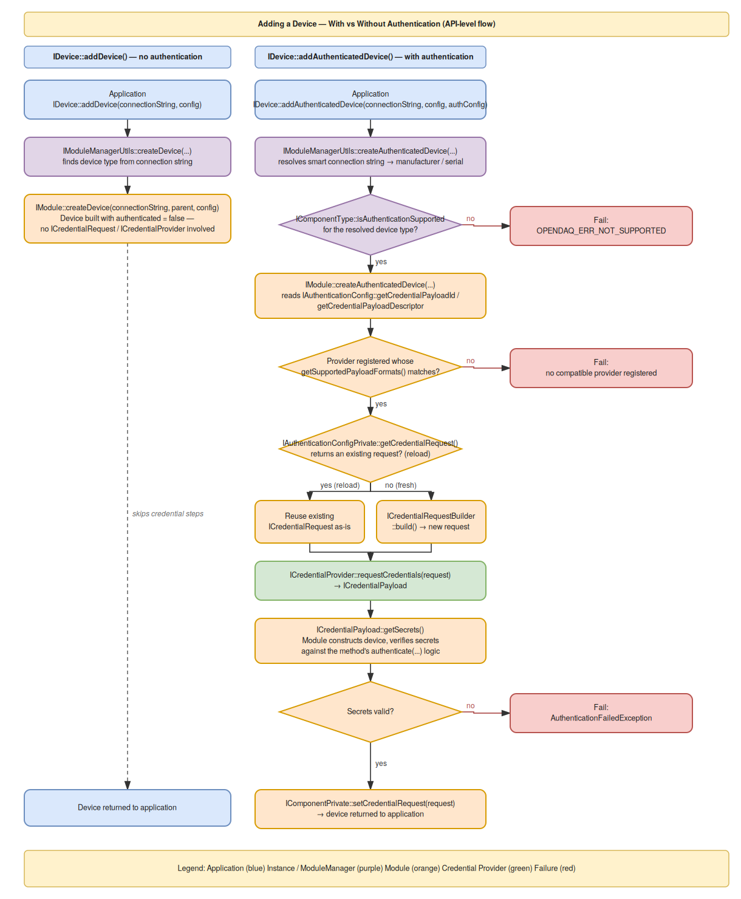

# Credential Provider Framework — API Reference & Authentication Flow

Credentials are modelled by their **payload shape** (`CredentialPayloadFormat`: `KeyValuePairs`, `String`, `FilePath`, or `BinaryBlob`) and a **payload descriptor** (`ICredentialPayloadDescriptor`) carrying format-specific parameters and a human description. Authentication method selection happens through an `IAuthenticationConfig` object, built per component type via `addSupportedAuthenticationConfig`.

---

## 1. Core Interfaces

### `ICredentialPayloadDescriptor`

Describes the shape and presentation of the payload an authentication method expects.

| Member | Description |
|---|---|
| `getFormat(CredentialPayloadFormat*)` | The payload's format — `KeyValuePairs`, `String`, `FilePath`, or `BinaryBlob`. |
| `getParameters(IPropertyObject**)` | The format's standard parameter set — for `KeyValuePairs`, a `"Keys"` dict mapping each expected key to a hidden flag (e.g. `{"UserName": False, "Password": True}`); for `String`, a single `"Hidden"` bool. |
| `getDescription(IString**)` | Human-readable description of the payload, e.g. *"PIN-code"*, *"username and password"*, *"Raw bytes of the SSH private key"*. |

**Factories:** `KeyValuePayloadDescriptor(keys, description)`, `StringPayloadDescriptor(description, hidden)`, `FilePathPayloadDescriptor(description)`, `BinaryBlobPayloadDescriptor(description)`

```cpp
enum class CredentialPayloadFormat : EnumType
{
    KeyValuePairs,  // N string pairs — e.g. UserName / Password
    String,         // one string — token, API key, PIN
    FilePath,       // one string — path to a file containing the secret, e.g. a private key
    BinaryBlob      // one raw byte buffer — pointer + size
};
```

---

### `IAuthenticationConfig`

Carries the authentication settings for a single connection attempt. Lives alongside the base add-component config, never serialized as part of it.

| Member | Description |
|---|---|
| `getCredentialPayloadId(IString**)` | The id of the payload associated with the selected authentication method. |
| `getCredentialPayloadDescriptor(ICredentialPayloadDescriptor**)` | The descriptor of the payload the selected method uses. |
| `getConfig(IPropertyObject**)` | Additional configuration specific to the selected method — settings that may travel with the credential request to the provider (e.g. hide input as typed) and, in some cases, directly-supplied credentials (e.g. a certificate file path). Supplied for this connection attempt only; never saved. |

**Factories:**
- `AuthenticationConfig(payloadId, payloadDescriptor, config = nullptr)` — normal construction path for a live connection attempt.
- `AuthenticationConfigFromCredentialRequest(credentialRequest)` — reconstructs a config from a previously saved `CredentialRequest`; used only when reloading a device that was previously added with authentication. Hidden from other language bindings; not for regular user code.

---

### `IAuthenticationConfigPrivate`

| Member | Description |
|---|---|
| `getCredentialRequest(ICredentialRequest**)` | The previously formed credential request this config was reconstructed from, or `nullptr` for a config built for a live attempt. When assigned, a module reuses this request as-is via `ICredentialProvider::requestCredentials` instead of forming a new one — it already carries the resolved, non-secret shape of the original request. |

---

### `ICredentialRequest`

Carries the non-secret details of a credential request, handed to `ICredentialProvider::requestCredentials`. Built via `ICredentialRequestBuilder`, or reconstructed on load. Never carries actual secrets.

| Member | Description |
|---|---|
| `getComponentType(IComponentType**)` | The type of component the request is for. |
| `getConnectionString(IString**)` | The connection string used for this connection attempt. |
| `getMetaData(IPropertyObject**)` | Additional metadata for the provider to present to the user (e.g. device type name/id/description). |
| `getManufacturer(IString**)` | The manufacturer of the device the request is for. |
| `getSerialNumber(IString**)` | The serial number of the device the request is for. |
| `getPayloadId(IString**)` | The id of the negotiated payload (from `IAuthenticationConfig`) — serialized on save, replayed on load. |
| `getPayloadDescriptor(ICredentialPayloadDescriptor**)` | The descriptor of the payload the provider must provide — serialized on save, or re-attached from the device type on load. |

**Factory:** `CredentialRequestFromBuilder(builder)` — hidden factory, built from a `ICredentialRequestBuilder`.

---

### `ICredentialRequestBuilder`

Builds `ICredentialRequest` objects.

| Member | Description |
|---|---|
| `build(ICredentialRequest**)` | Builds and returns a `CredentialRequest` from the currently configured values. |
| `setComponentType` / `getComponentType` | The component type the request is being built for. |
| `setConnectionString` / `getConnectionString` | The connection string for this attempt. |
| `setManufacturer` / `getManufacturer` | The device manufacturer. |
| `setSerialNumber` / `getSerialNumber` | The device serial number. |
| `addMetaDataProperty(IProperty*)` | Adds a metadata property, for the provider to present to the user. |
| `getMetaData(IPropertyObject**)` | The accumulated metadata property object. |
| `setPayloadId` / `getPayloadId` | The id of the negotiated payload. |
| `setPayloadDescriptor` / `getPayloadDescriptor` | The descriptor of the payload the provider must supply. |

**Factory:** `CredentialRequestBuilder()`

---

### `ICredentialPayload`

Container providing access to the secrets obtained from a provider.

| Member | Description |
|---|---|
| `getSecrets(IBaseObject**)` | The secret(s) carried by the payload. Concrete type depends on the payload format: `IString` for `String`- or `FilePath`-format, `IDict<IString, IString>` for `KeyValuePairs`, `IBinaryData` for `BinaryBlob` (raw bytes/size via `getAddress`/`getSize`). Callers are expected to know the format (from the `IAuthenticationConfig`/`ICredentialPayloadDescriptor` used) and cast accordingly. |

**Factories:**
- `KeyValueCredentialPayload(getValuesCb)` — `KeyValuePairs`-format payload; secrets returned as `IDict<IString, IString>`, keyed the same as the descriptor's `"Keys"` parameter.
- `StringCredentialPayload(getSecretCb)` — `String`-format payload; single secret returned directly as `IString`. Also used for `FilePath`-format payloads, which likewise resolve to a single `IString`.
- `BinaryBlobCredentialPayload(getBlobCb)` — `BinaryBlob`-format payload; single secret returned as `IBinaryData`.

**Implementation note:** `KeyValueCredentialPayloadImpl`, `StringCredentialPayloadImpl`, and `BinaryBlobCredentialPayloadImpl` are all type aliases of one templated `CredentialPayloadImpl<SecretInterface>`.

---

### `ICredentialProvider`

Supplies the secrets requested via an `ICredentialRequest` — by prompting the user, reading a file, or fetching from a secret store.

| Member | Description |
|---|---|
| `getName(IString**)` | The provider's name. |
| `requestCredentials(ICredentialRequest*, ICredentialPayload**)` | Requests credentials for the given request, in the format described by its payload descriptor. |
| `getSupportedPayloadFormats(IList**)` | The list of `CredentialPayloadFormat` values this provider can supply — used for format-matching against a device type's supported formats. |

**Factories:**
- `CmdLineCredentialProvider()` — prompts the user for secrets via the command line.
- `FileCredentialProvider()` — dedicated to file-backed secrets. Prompts for the file's path via the command line, the same way `CmdLineCredentialProvider` does. For a `FilePath`-format request it hands back the path itself; for a `BinaryBlob`-format request it reads the file and hands back its raw bytes instead, so the caller never has to touch the file itself. Supports both `FilePath` and `BinaryBlob` in `getSupportedPayloadFormats`. Retries the path prompt up to 3 times if the given path isn't accessible, then fails authentication.

---

## 2. Extensions to Existing Interfaces

### `IComponentType`

| New member | Description |
|---|---|
| `createDefaultAuthenticationConfig(IAuthenticationConfig**)` | Clones and returns the default authentication config; a new object on each call, same as `createDefaultConfig`. Returns `OPENDAQ_ERR_NOT_SUPPORTED` if the type doesn't support authentication (no default config set on its builder). |
| `getSupportedAuthenticationConfigs(IDict**)` | The authentication configs supported by this type, keyed by payload id. |
| `isAuthenticationSupported(Bool*)` | `True` if at least one config was added and a matching default id was set — in which case `createDefaultAuthenticationConfig` is guaranteed to succeed. |

### `IComponentTypeBuilder`

| New member | Description |
|---|---|
| `setDefaultAuthenticationConfigId(IString*)` | Sets which added config (by id) is the default. Left unset ⇒ the built type doesn't support authentication. |
| `getDefaultAuthenticationConfigId(IString**)` | Gets the id set above, or `nullptr`. |
| `addSupportedAuthenticationConfig(IString* id, ICredentialPayloadDescriptor*, IPropertyObject* config = nullptr)` | Adds a supported payload; builds and stores a full `AuthenticationConfig` immediately, keyed by `id`. |
| `getSupportedAuthenticationConfigs(IDict**)` | The configs built so far, keyed by payload id. |

**Validation on build:** if configs were added but no default id was set (or vice versa), or the default id doesn't match any added config, `build()` fails with `OPENDAQ_ERR_INVALIDPARAMETER`.

### `IDevice`

| New member | Description |
|---|---|
| `addAuthenticatedDevice(IDevice**, IString* connectionString, IPropertyObject* config = nullptr, IAuthenticationConfig* authenticationConfig = nullptr)` | Connects to a device using the given authentication configuration. |

### `IModuleManagerUtils`

| New member | Description |
|---|---|
| `createAuthenticatedDevice(IDevice**, IString* connectionString, IComponent* parent, IPropertyObject* config, IAuthenticationConfig* authenticationConfig)` | Iterates loaded modules, creating a device with the first one accepting the connection string and supporting authentication. Manufacturer/serial number are resolved from discovery info only for smart (`daq://`) connection strings; otherwise left unset. |

### `IModule`

| New member | Description |
|---|---|
| `createAuthenticatedDevice(IDevice**, IString* connectionString, IString* manufacturer, IString* serialNumber, IComponent* parent, IPropertyObject* config, IAuthenticationConfig* authenticationConfig)` | Module-level counterpart — receives manufacturer/serial resolved by the module manager, in addition to the authentication config. |

### `IInstanceBuilder`

| New member | Description |
|---|---|
| `getCredentialProviders(IDict**)` | The registered providers, keyed by name. |
| `addCredentialProvider(IString* providerName, ICredentialProvider*)` | Registers a provider under a unique name. |

### `IContext`

Extended with an additional `credentialProviders` parameter (`DictPtr<IString, ICredentialProvider>`) on the `Context` factory, and `getCredentialProviders(IDict**)` to retrieve them — providers registered on the instance builder flow through to the context, from which modules resolve them at authentication time.

---

## 3. Two Ways to Add a Device

The device can be added either **without authentication** (the plain, anonymous path) or **with authentication**. Both paths exist side by side — a device type that supports authentication doesn't lose its plain connection option, and the two are chosen simply by which method is called.

### The plain path (no authentication)

```cpp
auto device = instance.addDevice("daq://openDAQ_1234");
```

At the application level, this is a single call — no credential provider needs to be registered, and no authentication config is involved at all.

At the module level, this resolves to `Module::createDevice` (unchanged from before the credential framework existed). The device is constructed with `authenticated = false`, and the module's `authenticate(...)` step is skipped entirely — no payload, no provider lookup, no challenge or comparison of any kind.

### The authenticated path

```cpp
auto device = instance.addAuthenticatedDevice("daq://openDAQ_1234", nullptr, authenticationConfig);
```

The same connection string is used, but an `IAuthenticationConfig` is supplied, and everything described in the rest of this section — payload negotiation, provider lookup, credential retrieval, verification — is triggered as a result.

A device type only exposes this path if it supports authentication at all (`IComponentType::isAuthenticationSupported`); calling `addAuthenticatedDevice` against a type that doesn't returns `OPENDAQ_ERR_NOT_SUPPORTED`.

---

## 4. Authentication Flow

Both ways of adding a device converge on the same entry point at the application level — a connection string and a config object — and diverge based on whether an `IAuthenticationConfig` is supplied.

Without one, the call resolves straight down to the module's plain device-construction path: the module manager locates the appropriate device type from the connection string, and the module builds the device with no further involvement from the credential framework at all.

With one, the module manager first confirms the target device type actually supports authentication, then hands off to the module together with the authentication config. From there, the module works out which payload it needs, locates a credential provider capable of supplying it, and obtains a credential request — either reusing one carried over from a previous save (on reload) or building a fresh one. That request is handed to the provider, which returns the requested secrets; the module then verifies them and constructs the device. Whether the request was fresh or reused, the resulting credential request is stored on the device afterward, so a future reload can repeat this same process rather than needing the original secrets to be saved anywhere.



---

## 5. Application-Level Usage

### Registering credential providers

```cpp
auto credentialProvider = CmdLineCredentialProvider();

auto instanceBuilder = InstanceBuilder();
instanceBuilder.addCredentialProvider(credentialProvider.getName(), credentialProvider);
auto instance = instanceBuilder.build();
```

Provider registration happens once, at instance-build time, and is **never serialized** — a reloaded instance must register its own providers independently, since provider setup is platform-/host-specific. Multiple providers can be registered; when more than one supports the same payload format, the first one registered is enumerated first by the module while providers look-up.

### Selecting an authentication method

A device type may support several authentication methods at once. The application either accepts the type's default, or explicitly picks a different supported one:

```cpp
auto deviceType = instance.getAvailableDeviceTypes().get("CredentialDemoDevice");

// Use the type's default authentication method:
auto config = deviceType.createDefaultAuthenticationConfig();
auto device = instance.addAuthenticatedDevice("daq://openDAQ_1234", nullptr, config);

// Or explicitly select a specific supported method instead (e.g. "Pin"):
auto pinConfig = deviceType.getSupportedAuthenticationConfigs().get("Pin");
auto device2 = instance.addAuthenticatedDevice("daq://openDAQ_1234", nullptr, pinConfig);
```

### Example: private-key challenge authentication

```cpp
auto fileCredentialProvider = FileCredentialProvider();
auto cmdLineCredentialProvider = CmdLineCredentialProvider();

auto instanceBuilder = InstanceBuilder();
// Registered first, so it — not CmdLineCredentialProvider — is picked for FilePath/BinaryBlob requests.
instanceBuilder.addCredentialProvider(fileCredentialProvider.getName(), fileCredentialProvider);
instanceBuilder.addCredentialProvider(cmdLineCredentialProvider.getName(), cmdLineCredentialProvider);
auto instance = instanceBuilder.build();

auto deviceType = instance.getAvailableDeviceTypes().get("CredentialDemoDevice");

// FilePath variant — module reads and parses the PEM file itself.
auto privateKeyFileConfig = deviceType.getSupportedAuthenticationConfigs().get("PrivateKeyFile");
auto device = instance.addAuthenticatedDevice("daq://openDAQ_1234", nullptr, privateKeyFileConfig);

// BinaryBlob variant — provider reads the file, module only ever sees raw key bytes.
auto privateKeyBlobConfig = deviceType.getSupportedAuthenticationConfigs().get("PrivateKeyBlob");
auto device2 = instance.addAuthenticatedDevice("daq://openDAQ_1234", nullptr, privateKeyBlobConfig);
```


### Save and reload

Saving an instance persists the connected device's `CredentialRequest` (connection info, payload id and descriptor, metadata) as part of the tree — but never the `AuthenticationConfig` or the actual secrets. Reloading that saved configuration into a new instance re-authenticates the device from scratch: the new instance must have its own compatible credential provider registered, or the reload fails.

---

## 6. Module-Level Implementation

This section describes what a module does internally when `Module::createAuthenticatedDevice` is called — none of this is visible to, or called directly by, application code.

> **Note:** the steps below describe how the credential-demo prototype implements this — provider lookup (currently: first registered provider whose supported formats match) and retry/fallback behavior on failure may differ in a production implementation, since neither is prescribed by the core interfaces themselves.

1. **Resolve the payload to provide.** The module reads the payload id and descriptor off the supplied `IAuthenticationConfig` (`getCredentialPayloadId`, `getCredentialPayloadDescriptor`).

2. **Find a matching credential provider.** The module looks through the providers registered on the context (`IContext::getCredentialProviders`) and picks the first one whose `getSupportedPayloadFormats()` includes the payload descriptor's format. If none match, authentication fails immediately.

3. **Obtain or reuse the credential request.** If the `IAuthenticationConfig` was reconstructed from a saved device (i.e. this is a reload, not a fresh connection), `IAuthenticationConfigPrivate::getCredentialRequest()` returns the original request as-is, and the module reuses it unchanged. Otherwise, the module builds a new `ICredentialRequest` via `ICredentialRequestBuilder`, populating connection string, manufacturer/serial number (if resolved), and metadata for the provider to present to the user.

4. **Request the credentials.** The module calls `provider.requestCredentials(request)`, receiving an `ICredentialPayload` in return, in whatever format the payload descriptor specified.

5. **Construct the device and authenticate.** The device is constructed and its `authenticate(payload, payloadId)` step runs — extracting the secrets (`getSecrets()`) and verifying them against whatever the specific authentication method requires (a fixed value, a signed challenge, etc.). A mismatch throws `AuthenticationFailedException`, and device creation fails.

6. **Persist the credential request for later reload.** On success, the module stores the credential request on the newly created device (`IComponentPrivate::setCredentialRequest`) — this is what step 3 reads back on a future reload, without ever needing to persist the secrets themselves.

