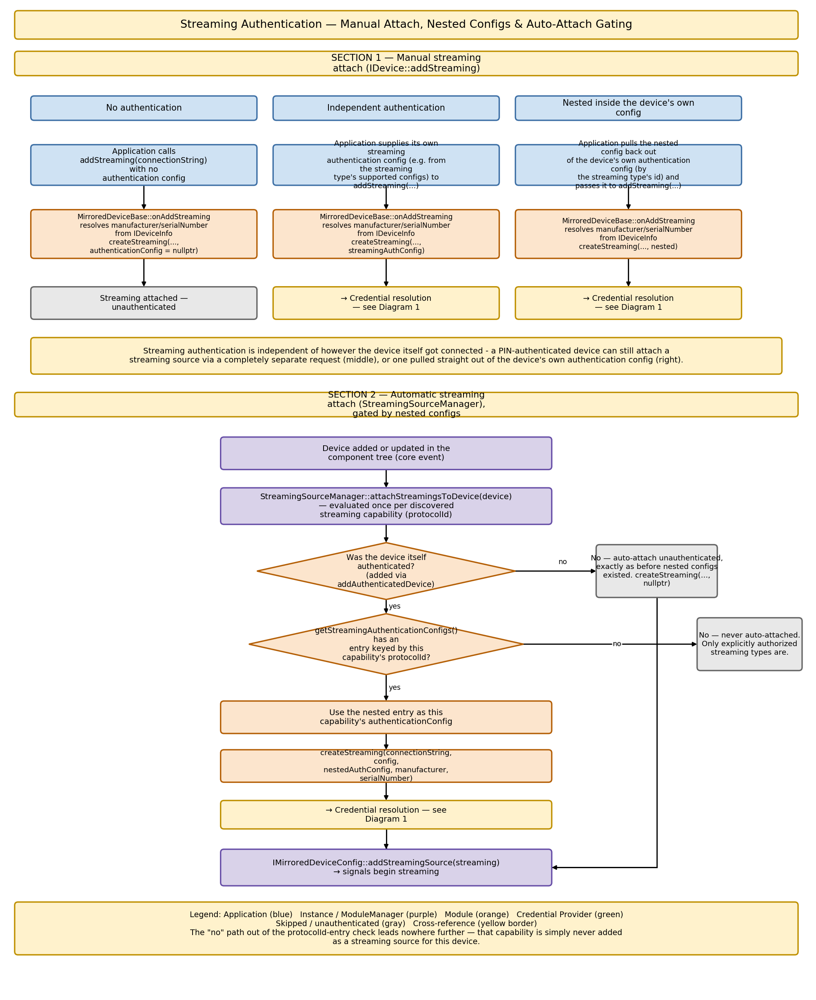
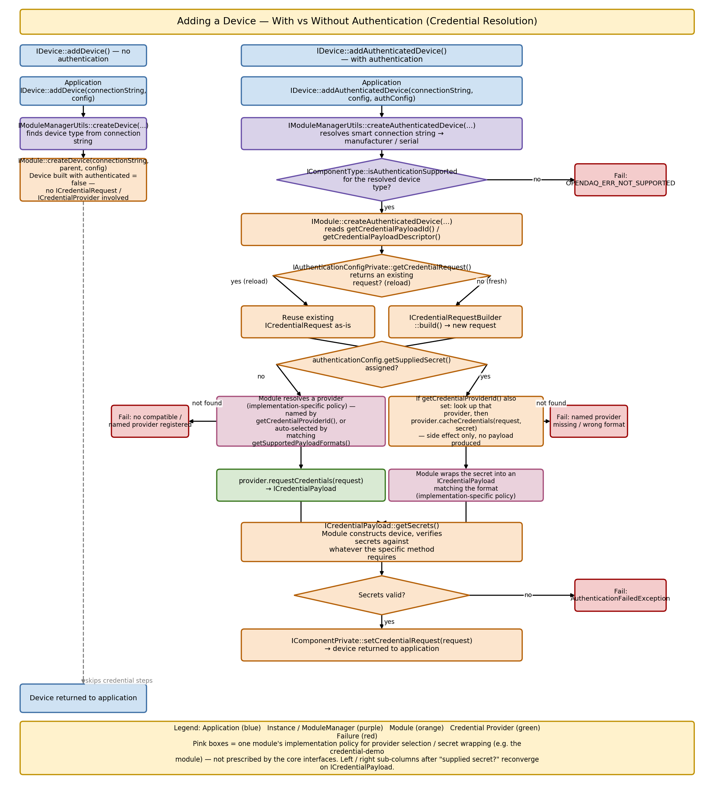
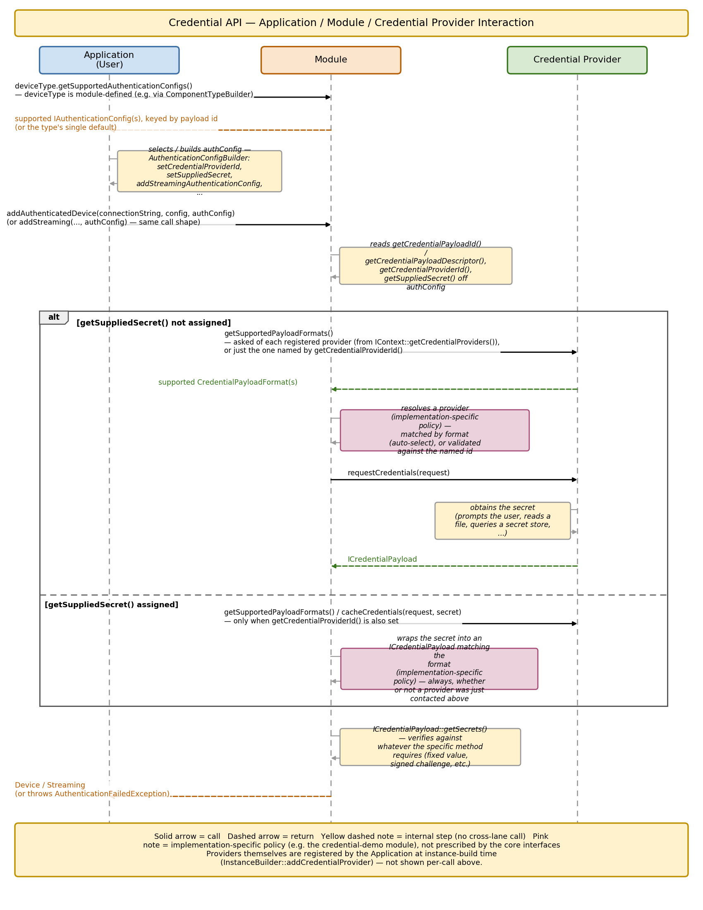

# Credential Provider Framework — API Reference & Authentication Flow

> **Stale pending a doc pass:** `addAuthenticatedDevice`/`createAuthenticatedDevice` and `addStreaming`/`createStreaming`'s
> `authenticationConfig` parameter, referenced throughout this document, have been removed - only the plain,
> config-only overloads (`addDevice`/`createDevice`, `addStreaming`/`createStreaming` with no such parameter)
> remain. As a temporary, hacky bridge until `IAuthenticationConfig` becomes a real part of the add-device config
> schema, a caller instead stashes the config onto the plain `config` property object under the
> `"__AuthenticationConfig"` property name (see `AuthenticationConfigConfigKey`/`InjectAuthenticationConfig`/
> `ExtractAuthenticationConfig` in `core/opendaq/modulemanager/include/opendaq/module_impl.h`, reused by
> `ModuleManagerImpl`; `GenericDevice`'s reload path and application code each keep their own small local copy of
> the same key, since sharing it across components isn't worth a public header for what's meant to be temporary).
> Every code snippet below using `addAuthenticatedDevice`/`createAuthenticatedDevice` needs updating accordingly -
> see `examples/applications/cpp/credential_providers/credential_providers.cpp`'s `WithAuthenticationConfig` helper
> for the current, correct pattern in the meantime.

Credentials are modelled as a dictionary of named **fields** per authentication method (`IAuthenticationMethod::getFields()`), each one an `ICredentialField` naming how its value should be collected - `Text`, `Secret` (masked), or `FilePath`. Authentication method selection happens through an `IAuthenticationConfig` object - a single, self-contained property object built with `AuthenticationConfig(componentType)`, listing every method the named component type itself declares supporting (via `IComponentType::getSupportedAuthenticationMethods()`, set once when the module built the type) as a candidate the caller selects among directly, tunes, and hands to `addAuthenticatedDevice`/`addStreaming`.

At most one credential provider can ever be registered for an entire `Instance` - on `IInstanceBuilder`, at build time, before the instance's `Context` even exists (see [§2](#2-extensions-to-existing-interfaces)) - so there is no per-config provider selection at all: `IAuthenticationConfig` doesn't carry a provider id, and a module always uses whichever single provider (if any) `IContext::getCredentialProvider()` returns.

---

## 1. Core Interfaces

### `IAuthenticationMethod`

Describes one way to authenticate - its id, a human-readable description, and the named credential fields it needs (if any). A plain object, not a Struct - not registered with any `ITypeManager`.

| Member | Description |
|---|---|
| `getId(IString**)` | The id that uniquely identifies this authentication method at least within the module that offers it - the same id the module declares as its default, and that a caller matches against when selecting this method out of an `IAuthenticationConfig`'s `"AuthenticationMethod"` candidates (see below). In practice often unique system-wide instead: the `Standard*AuthenticationMethod` factories key off shared, well-known ids, so different modules using the same standard id produce identically-shaped authentication methods, reusing the id deliberately rather than colliding by accident. |
| `getFields(IDict**)` | The named credential fields this method expects, keyed by name, in declaration order - empty for a method that needs no credentials at all, e.g. anonymous access. Each value is an `ICredentialField`. |
| `getDescription(IString**)` | Human-readable description of the authentication method, e.g. *"PIN-code"*, *"username and password"*, *"Path to the SSH private key file"*. |

**`ICredentialField`** - describes a single credential field:

| Member | Description |
|---|---|
| `getId(IString**)` | The key this field is stored under in the credential and in `getFields()` - e.g. `"Username"`, `"Password"`, `"PrivateKeyFilePath"`. |
| `getKind(CredentialFieldKind*)` | How this field's value should be collected/presented. |
| `getName(IString**)` | A human-readable name for this field, for the user - e.g. *"User name"*, *"Private key file"*. |
| `getMetadata(IDict**)` | Hints for whoever collects this field's value, as a `Dict<IString, IString>`. Well-known key `"Extensions"` for a `FilePath` field: comma-separated, without the dot (e.g. `"pem,key"`); absent or empty means any file. |
| `isRequired(Bool*)` | Whether this field cannot be left unset or empty - e.g. a password might be optional but not the username within the same authentication method. |

```cpp
enum class CredentialFieldKind : EnumType
{
    Text = 0, // shown as typed - e.g. a username
    Secret,   // masked as typed - e.g. a password or PIN
    FilePath  // a path to a file - e.g. a private key file
};
```

**Factory:** `CredentialField(id, kind, name, metadata = {}, required = True)`.

**`CredentialSatisfiesMethod(authenticationMethod, credential)`** - a free function (not a method on the interface) that checks whether `credential` - a dictionary of field value(s), keyed by their own field id (see [Credentials](#credentials) below) - is usable as-is for `authenticationMethod`: every field it marks required (`ICredentialField::isRequired`) must be present among `credential`'s keys with a non-empty value. A field that isn't required is never checked, whether present or not. `false` if `authenticationMethod` itself is unassigned.

**Factories:** `AuthenticationMethod(id, fields, description)` - the one general factory, `fields` a dict of name → `ICredentialField`; `NoneAuthenticationMethod(id, description)` - a convenience wrapper with an empty fields dict, for a method that needs no credentials at all. No `ITypeManager` involved anywhere; `IAuthenticationMethod`/`ICredentialField` are plain objects, not Structs, so there's no type to register.

**Standard authentication methods:** `StandardUserNamePasswordAuthenticationMethod()`, `StandardPinAuthenticationMethod()`, `StandardPrivateKeyFileAuthenticationMethod()`, and `StandardAnonymousAuthenticationMethod()` build ready-made authentication methods for four well-known methods, each keyed by its own well-known id (`StandardUserNamePasswordId` = `"UserNamePassword"`, `StandardPinId` = `"Pin"`, `StandardPrivateKeyFileId` = `"PrivateKeyFile"`, `StandardAnonymousId` = `"Anonymous"`) - so every module offering one of these methods produces the exact same authentication method and credential shape, rather than each inventing its own. `StandardUserNamePasswordAuthenticationMethod` has two fields (`"UserName"`: `Text`, `"Password"`: `Secret`); `StandardPinAuthenticationMethod` has one (`"Pin"`: `Secret`); `StandardPrivateKeyFileAuthenticationMethod` has one (`"PrivateKeyFilePath"`: `FilePath`); `StandardAnonymousAuthenticationMethod` has none.

---

### `IAuthenticationConfig`

Carries the authentication settings for a single connection attempt. Lives alongside the base add-component config, never serialized as part of it - though a component created with authentication may persist a reduced form of the config it was authenticated with alongside itself instead (see [Serialization](#serialization) below and [§7](#7-application-level-usage)).

`IAuthenticationConfig` extends `IPropertyObject` - the settings below are backed by ordinary properties, so besides the typed getters, they can equally be read and set through the generic `IPropertyObject` interface:

| Property | Description |
|---|---|
| `"AuthenticationMethod"` (Selection) | Candidates are the supported methods' own ids, as plain strings - the selection value is the currently selected id (`getSelectedAuthenticationMethod()`'s typed equivalent returns the full method object, looked up by this id). The real `IAuthenticationMethod` objects (fields and all) are reached separately, via `getSupportedAuthenticationMethods()`, keyed by that same id. A config returned by `AuthenticationConfig(componentType)` (see [§2](#2-extensions-to-existing-interfaces)) is self-contained - every authentication method the component type supports is a selection candidate here, not just one - so the caller switches methods by changing this property's selection, without fetching a different config object. Changing this property unconditionally resets `"SuppliedCredential"` back to empty, whatever it held before. |
| `"SuppliedCredential"` (Dict) | A credential supplied directly by the caller, to be used instead of the registered credential provider obtaining it - a dictionary of field value(s), keyed by their own field id (see [Credentials](#credentials) below). Its default value is an empty dictionary, which means "none supplied" (the registered provider is asked instead). A non-empty value counts as supplied, and is validated against the *currently selected* `"AuthenticationMethod"` on every write: it must carry a non-empty value for every field the method marks required (see `CredentialSatisfiesMethod`), or the write is rejected. Changing `"AuthenticationMethod"` always resets this property back to empty first, whatever it held before - a credential supplied for the previous method is never meaningful for the new one, compatible-looking or not. See [§5](#5-credential-provider-selection--supplied-credentials). |

| Member | Description |
|---|---|
| `getSelectedAuthenticationMethod(IAuthenticationMethod**)` | Convenience getter for the full authentication method matching the selected `"AuthenticationMethod"` value's id - looked up in `getSupportedAuthenticationMethods()` internally, so the caller doesn't have to. |
| `getSuppliedCredential(IDict**)` | Convenience getter for the `"SuppliedCredential"` property's value. Always assigned - empty means none was supplied. |

There is no "additional config" on `IAuthenticationConfig` itself - settings like whether to hide credential input as it's typed travel via the component's own, generic config object instead (the same one `addDevice`/`addStreaming` always take), read by the module from its own `config` parameter alongside the authentication config. Nor is there any credential-provider selection on it at all - see [§5](#5-credential-provider-selection--supplied-credentials).

**Factory:** two overloads.
- `AuthenticationConfig(componentType)` — the recommended way to build a config for a live device/streaming type. Reads `authenticationMethods` straight off `componentType`'s own `getSupportedAuthenticationMethods()` (see [§2](#2-extensions-to-existing-interfaces)) - the type itself is the single source of truth for what it supports, set once via `IComponentTypeBuilder` when the module built it.
- `AuthenticationConfig(authenticationMethods)` — the lower-level overload, for building a config with no live `IComponentType` object at hand (e.g. deserialization). Each entry of `authenticationMethods` (a dict keyed by each authentication method's own id) becomes one candidate value of the resulting config's `"AuthenticationMethod"` Selection property, so a caller can later switch between methods just by changing that property's selection instead of needing a different config object per method; the dict's first entry, in iteration order, starts out selected.

`"SuppliedCredential"` is never set by either factory - set it afterward via that property directly, the same way regardless of which one built the config.

**Serialization:** entirely custom - replaces the inherited generic `IPropertyObject` mechanism (mirrors `DeviceTypeImpl`'s own pattern). Writes exactly two things: the full `supportedAuthenticationMethods` dict (every candidate `IAuthenticationMethod`, self-serializing via its own `ISerializable`) and the currently selected id. `"SuppliedCredential"` is never written. Deserializing rebuilds the config directly from those two pieces, via the real constructor plus `setAuthenticationMethodId()` to restore the saved selection - fully self-contained, no module/type registry re-consultation needed.

---

### `ICredentialRequest`

Carries the details of a credential request (but never the credential itself), handed to `ICredentialProvider::requestCredentials`/`cacheCredentials`. Built via `ICredentialRequestBuilder`.

| Member | Description |
|---|---|
| `getComponentType(IComponentType**)` | The type of component the request is for. |
| `getConnectionString(IString**)` | The *canonical* connection string of this connection attempt - already resolved via the owning module's `onGetCanonicalConnectionString` (routing prefix trimmed, every parameter made explicit), not necessarily the raw string the caller originally supplied. |
| `getMetaData(IPropertyObject**)` | Additional metadata for the provider to present to the user. Optional - empty (no properties) if the caller added none. |
| `getManufacturer(IString**)` | The manufacturer of the device the connection is being established to or for - a request can be for a direct connection to that device, or for a streaming connection attached to it. Optional - unassigned if not known for this connection. |
| `getSerialNumber(IString**)` | The serial number of the device the connection is being established to or for - a request can be for a direct connection to that device, or for a streaming connection attached to it. Optional - unassigned if not known for this connection. |
| `getModel(IString**)` | The model of the device the connection is being established to or for - a request can be for a direct connection to that device, or for a streaming connection attached to it. Optional - unassigned if not known for this connection. |
| `getAuthenticationMethod(IAuthenticationMethod**)` | The authentication method the provider must provide a credential for, read from `IAuthenticationConfig` when the request was built. Its own id names the negotiated authentication method. |

**Why canonical?** A provider identifies which connection a request belongs to primarily by `(manufacturer, serialNumber, model)` - e.g. `CmdLineCredentialProvider`'s in-session `FilePath` caching (see [§5](#5-credential-provider-selection--supplied-credentials)). When neither manufacturer nor serial number is available, a provider falls back to the connection string itself as the identifying key instead (model alone is never enough to identify a specific device) - which only works reliably if it's canonical, so the same connection always identifies itself the same way no matter how the caller originally wrote it.

**Factory:** `CredentialRequestFromBuilder(builder)` — hidden factory, built from a `ICredentialRequestBuilder`.

---

### `ICredentialRequestBuilder`

Builds `ICredentialRequest` objects.

| Member | Description |
|---|---|
| `build(ICredentialRequest**)` | Builds and returns a `CredentialRequest` from the currently configured values. Fails if `componentType`, `connectionString`, or `authentication method` was never set. |
| `setComponentType` / `getComponentType` | The component type the request is being built for. Required. |
| `setConnectionString` / `getConnectionString` | The *canonical* connection string for this attempt - expected to already be resolved via `onGetCanonicalConnectionString` before being set here. Required. |
| `setManufacturer` / `getManufacturer` | The manufacturer of the device the connection is being established to or for - a request can be for a direct connection to that device, or for a streaming connection attached to it. Optional - leave unset if not known. |
| `setSerialNumber` / `getSerialNumber` | The serial number of the device the connection is being established to or for - a request can be for a direct connection to that device, or for a streaming connection attached to it. Optional - leave unset if not known. |
| `setModel` / `getModel` | The model of the device the connection is being established to or for - a request can be for a direct connection to that device, or for a streaming connection attached to it. Optional - leave unset if not known. |
| `addMetaDataProperty(IProperty*)` | Adds a metadata property, for the provider to present to the user. Optional - the built request's metadata is simply empty if never called. |
| `getMetaData(IPropertyObject**)` | The accumulated metadata property object. |
| `setAuthenticationMethod` / `getAuthenticationMethod` | The authentication method the provider must supply a credential for - typically read from `IAuthenticationConfig` when the request is built. Its own id names the negotiated authentication method. Required. |

**Factory:** `CredentialRequestBuilder()`

---

### Credentials

There is no dedicated credential interface - a credential is simply a `Dict<IString, IString>`, one entry per field, keyed by each field's own id (see `ICredentialField::getId`). An entry for a field that isn't required may be left out entirely, or supplied empty; `CredentialSatisfiesMethod(authenticationMethod, credential)` is what checks a given credential actually carries a non-empty value for every field the method marks required. Both a credential provider's `requestCredentials` and a caller directly supplying a credential (`IAuthenticationConfig`'s `"SuppliedCredential"` property) produce/consume this exact same shape - see [§5](#5-credential-provider-selection--supplied-credentials).

A method with no fields needs no credentials at all - an empty dictionary always satisfies it trivially, `"SuppliedCredential"` stays at its empty default, and no credential provider is ever consulted for it (see [§8](#8-module-level-implementation)); selecting `"AuthenticationMethod"` to such a method is the entire authentication step.

---

### `ICredentialProvider`

Supplies the credentials requested via an `ICredentialRequest` — by prompting the user, reading a file, or fetching from a credential store. Declares no supported field kinds up front - if a request needs a field kind an implementation can't handle, `requestCredentials`/`cacheCredentials` is expected to fail on its own (an ordinary failed call, propagated like any other failure from them, all the way back to the original `addDevice`/`addStreaming` caller), rather than being pre-checked by `Module`.

| Member | Description |
|---|---|
| `getDescription(IString**)` | A human-readable description of the provider - e.g. for identifying it in a log message or an error. Not an id - not expected to be unique, or stable across implementations. |
| `requestCredentials(ICredentialRequest*, IDict**)` | Requests credentials for the given request, in the shape described by its authentication method — obtaining them interactively (prompting, reading a file, etc.) unless a cached value from an earlier `cacheCredentials`/`requestCredentials` call for the same context already covers it. Returns a dictionary of field value(s), keyed by their own field id. Fails if this implementation can't actually collect one of the request's field kinds. |
| `cacheCredentials(ICredentialRequest*, IDict* credential)` | Accepts a credential already known in advance (see `IAuthenticationConfig`'s `"SuppliedCredential"` property) - a dictionary of field value(s), keyed by their own field id - so an implementation that would otherwise cache a value obtained interactively caches this one the same way — a later `requestCredentials` call for the same context then reuses it instead of prompting. Produces nothing itself; the caller already has it and uses it directly. Implementations for which caching doesn't apply may treat this as a no-op. |

**Factory:**
- `CmdLineCredentialProvider()` — the only credential provider implementation the SDK ships. Prompts the user for credentials via the command line, supporting every `CredentialFieldKind`: `Text`/`Secret` fields are read as plain (or masked) input; `FilePath` is read exactly the same way as `Text` - no local validation or retry of its own on a cache hit - but is validated locally (must name an existing, accessible file) right after being freshly read. Every field, whatever its kind, is cached in-memory for its own lifetime (i.e. for the active session), as one entry per `(manufacturer, serialNumber, model, authentication method id)` carrying every field value cached so far for that method - not one independent entry per field - so a second interactive request for the same device via the same method reuses every value already entered (or supplied via `cacheCredentials`) instead of prompting again, `Secret` fields included.

---

## 2. Extensions to Existing Interfaces

Component types (`IComponentType` and everything derived from it, including `IDeviceType`/`IStreamingType`) carry their supported authentication data as genuine Struct fields: `getSupportedAuthenticationMethods()` (the authentication methods it supports, keyed by their own id) and `getDefaultAuthenticationMethodId()`. A module declares these once, via `IComponentTypeBuilder::setSupportedAuthenticationMethods`/`setDefaultAuthenticationMethodId`, when it builds the device or streaming type - left unset, a type defaults to supporting only the standard `"Anonymous"` method. (Server and Function block types do not carry this data - only Device and Streaming types do.) To build the self-contained `IAuthenticationConfig` for a type, call `AuthenticationConfig(componentType)` directly (see [§1](#1-core-interfaces)) - there's no separate method on `IDevice`/`IModule` for this anymore.

### `IDevice`

| New member | Description |
|---|---|
| `addAuthenticatedDevice(IDevice**, IString* connectionString, IPropertyObject* config = nullptr, IAuthenticationConfig* authenticationConfig = nullptr)` | Connects to a device using the given authentication configuration. |
| `addStreaming(IStreaming**, IString* connectionString, IPropertyObject* config = nullptr, IAuthenticationConfig* authenticationConfig = nullptr)` | Attaches a streaming connection, optionally authenticated — a `nullptr` config (the default) uses the plain, unauthenticated path. See [§4](#4-streaming-authentication). |

### `IModuleManagerUtils`

| New member | Description |
|---|---|
| `createAuthenticatedDevice(IDevice**, IString* connectionString, IComponent* parent, IPropertyObject* config, IAuthenticationConfig* authenticationConfig)` | Iterates loaded modules, creating a device with the first one accepting the connection string and supporting authentication. Manufacturer/serial number are resolved from discovery info only for smart (`daq://`) connection strings; otherwise left unset. |
| `createStreaming(IStreaming**, IString* connectionString, IPropertyObject* config = nullptr, IAuthenticationConfig* authenticationConfig = nullptr, IDevice* owner = nullptr)` | Iterates loaded modules, creating a streaming connection with the first one accepting the connection string. Unlike `createAuthenticatedDevice`, there is no smart-string/discovery resolution here — streaming connection strings are always concrete, protocol-specific ones — so `owner` (the device the streaming connection is being attached to - manufacturer/serial number/model all read from its own `IDeviceInfo`) is simply forwarded as given. |

### `IModule`

| New member | Description |
|---|---|
| `createAuthenticatedDevice(IDevice**, IString* connectionString, IString* manufacturer, IString* serialNumber, IComponent* parent, IPropertyObject* config, IAuthenticationConfig* authenticationConfig)` | Module-level counterpart — receives manufacturer/serial resolved by the module manager, in addition to the authentication config. |
| `createStreaming(IStreaming**, IString* connectionString, IPropertyObject* config, IAuthenticationConfig* authenticationConfig, IDevice* owner)` | Module-level counterpart of `IModuleManagerUtils::createStreaming`. |

### `IInstanceBuilder`

| New member | Description |
|---|---|
| `getCredentialProvider(ICredentialProvider**)` | The credential provider set so far, or `nullptr` if none. |
| `setCredentialProvider(ICredentialProvider*)` | Sets the credential provider to register on the built instance's `Context`, replacing whatever was set before. At most one can ever be registered on an instance - there is no way to add more than one, and no way to register one on an already-built `Context` either. |

### `IContext`

Extended with an additional `credentialProvider` parameter (`ICredentialProvider*`) on the `Context` factory - whatever was set via `IInstanceBuilder::setCredentialProvider` flows in through it - and `getCredentialProvider(ICredentialProvider**)` to retrieve it, or `nullptr` if nothing was set. Construction is the only way in - a `Context`, once built, offers no way to change it.

---

## 3. Two Ways to Add a Device

The device can be added either **without authentication** (the plain, anonymous path) or **with authentication**. Both paths exist side by side — a device type that supports authentication doesn't lose its plain connection option, and the two are chosen simply by which method is called.

### The plain path (no authentication)

```cpp
auto device = instance.addDevice("daq://openDAQ_1234");
```

At the application level, this is a single call — no credential provider needs to be registered, and no authentication config is involved at all.

At the module level, this resolves to `Module::createDevice`. The device is constructed with `authenticated = false`, and the module's own credential-verification step is skipped entirely — no credential, no provider lookup, no challenge or comparison of any kind.

### The authenticated path

```cpp
auto device = instance.addAuthenticatedDevice("daq://openDAQ_1234", nullptr, authenticationConfig);
```

The same connection string is used, but an `IAuthenticationConfig` is supplied, and everything described in the rest of this document — credential negotiation, provider lookup, credential retrieval, verification — is triggered as a result.

A device type only exposes this path meaningfully when it declares at least one supported authentication method (see [§2](#2-extensions-to-existing-interfaces)) - `AuthenticationConfig(componentType)` still succeeds otherwise (every type defaults to `"Anonymous"`), but `addAuthenticatedDevice` against a type that only supports `"Anonymous"` gains nothing over the plain path.

---

## 4. Streaming Authentication

Attaching a streaming connection is authenticated **independently** of however the device itself got connected — a device authenticated via PIN can have a streaming source attached to it that goes through its own, entirely separate credential request. `IDevice::addStreaming`'s last parameter is the authentication config, exactly mirroring `addAuthenticatedDevice`: a `nullptr` config uses the plain, unauthenticated path; a supplied one triggers the same provider-lookup/credential-request machinery described for devices.

```cpp
// Plain, unauthenticated streaming attach:
device.addStreaming("daq.credential_demo_streaming://credential_demo_device");

// Authenticated streaming attach, with its own independent authentication config:
auto streamingAuthConfig = AuthenticationConfig(streamingType);
SelectAuthenticationMethod(streamingAuthConfig, "PrivateKeyFile"); // see §7 - switches the selection generically
device.addStreaming("daq.credential_demo_streaming://credential_demo_device", nullptr, streamingAuthConfig);
```

### Auto-attach is always unauthenticated

`StreamingSourceManager` (the implementation behind the `PrioritizedStreamingProtocols`/`AutomaticallyConnectStreaming` add-device config) auto-attaches streaming sources for a device once it's added, always via the plain, unauthenticated path — regardless of whether the device itself was authenticated (`addAuthenticatedDevice`) or not. A streaming source that needs authentication must be attached manually, via `addStreaming`'s own authentication config parameter, as shown above.


*Diagram 2 — manual `addStreaming` (unauthenticated or independently authenticated), and `StreamingSourceManager`'s always-unauthenticated auto-attach. The authenticated manual path hands off to the same credential resolution shown in Diagram 1 ([§6](#6-authentication-flow)).*

---

## 5. Credential Provider Selection & Supplied Credentials

There is no provider *selection* at all - at most one credential provider can ever be registered for an entire `Instance` (see [§2](#2-extensions-to-existing-interfaces)), and a module always uses that one, if any (see [§8](#8-module-level-implementation)). `IAuthenticationConfig` carries no provider id, and there is nothing to configure on it for this - only `"SuppliedCredential"` lets a caller take over part of the credential machinery that would otherwise happen automatically.

### Supplying the credential directly

Setting `"SuppliedCredential"` hands the module a credential it already has — a dictionary of field value(s), keyed by their own field id — instead of having the registered provider obtain one interactively. A non-empty write is validated against the *currently selected* `"AuthenticationMethod"` (see [§1](#1-core-interfaces)): it must carry a non-empty value for every field the method marks required, so select the method first:

```cpp
auto config = AuthenticationConfig(deviceType); // UserNamePassword is the default method

auto credential = Dict<IString, IString>();
credential.set("UserName", "user");
credential.set("Password", "pass");
config.setPropertyValue("SuppliedCredential", credential);

auto device = instance.addAuthenticatedDevice("daq://openDAQ_1234", nullptr, config);
```

- **No credential provider registered:** the module uses the supplied credential directly and authenticates with it, with no prompt of any kind.
- **A provider is registered:** the module still uses the supplied credential directly for this connection, but first hands both it and the credential request to that provider via `ICredentialProvider::cacheCredentials`, so the provider can remember it the same way it would one obtained interactively.

The second case is what makes it possible for a *later*, ordinary `requestCredentials` call — e.g. authenticating a streaming connection attached to the same device — to be served from the provider's cache instead of prompting, provided the provider actually caches for that field kind (see `CmdLineCredentialProvider`'s `FilePath` caching) and the two requests share the same `(manufacturer, serialNumber, model)`:

```cpp
auto deviceConfig = AuthenticationConfig(deviceType);
SelectAuthenticationMethod(deviceConfig, "PrivateKeyFile");

auto deviceCredential = Dict<IString, IString>();
deviceCredential.set("PrivateKeyFilePath", "/path/to/private_key.pem");
deviceConfig.setPropertyValue("SuppliedCredential", deviceCredential);

auto device = instance.addAuthenticatedDevice("daq://openDAQ_1234", nullptr, deviceConfig);

// Same device, same FilePath field - no path prompt this time; the registered provider serves
// it from the cache `cacheCredentials` populated above.
auto streamingConfig = AuthenticationConfig(streamingType);
SelectAuthenticationMethod(streamingConfig, "PrivateKeyFile");
device.addStreaming("daq.credential_demo_streaming://credential_demo_device", nullptr, streamingConfig);
```

For the credential-demo module specifically, `MirroredDeviceBase::onAddStreaming` forwards the device itself (as `createStreaming`'s `owner`) into the streaming connection attempt - the module resolves manufacturer/serial number/model from its own `IDeviceInfo` - so a manually-attached streaming connection for the same device naturally lands in the same cache bucket.

---

## 6. Authentication Flow

Both ways of adding a device converge on the same entry point at the application level — a connection string and a config object — and diverge based on whether an `IAuthenticationConfig` is supplied.

Without one, the call resolves straight down to the module's plain device-construction path: the module manager locates the appropriate device type from the connection string, and the module builds the device with no further involvement from the credential framework at all.

With one, the module manager first confirms the target device type actually supports authentication, then hands off to the module together with the authentication config. From there, the module works out which authentication method it needs, resolves the credentials for it — the single registered credential provider, if any (see [§5](#5-credential-provider-selection--supplied-credentials)) obtaining them interactively, or a directly-supplied credential used instead — and builds a fresh credential request for it, whether this is a first-time connection or a reload. The module then verifies the obtained credentials and constructs the device. The authentication config itself (not the credential request, which is never saved) is then stored on the device afterward, in reduced form - so a future reload can repeat this same resolution process rather than needing the original credentials to be saved anywhere.


*Diagram 1 — the plain vs. authenticated add-device paths, and the credential-resolution branching (the single registered credential provider, interactive `requestCredentials` vs. a directly-supplied credential). The same resolution applies verbatim to authenticating a streaming connection (Diagram 2, [§4](#4-streaming-authentication)) — only the surrounding API call differs. The pink steps (resolving the registered provider, credential-wrapping) are `Module`'s own shared base-class implementation (`requestCredentials`/`obtainCredentials`, see [§8](#8-module-level-implementation)) — not something the core interfaces prescribe, but also not something a module supporting authentication needs to reimplement itself.*

---

## 7. Application-Level Usage

### Registering the credential provider

```cpp
auto credentialProvider = CmdLineCredentialProvider();

auto instanceBuilder = InstanceBuilder();
instanceBuilder.setCredentialProvider(credentialProvider);
auto instance = instanceBuilder.build();
```

Provider registration is **never serialized** — a reloaded instance must register its own provider independently, since provider setup is platform-/host-specific. At most one credential provider can ever be registered, and only at instance-build time (`IInstanceBuilder::setCredentialProvider`) - there is no way to register one on an already-built `Context`, and no way to register more than one. `CmdLineCredentialProvider`, used above, supports every format, so a single instance of it is enough regardless of which authentication methods the connected devices use.

### Selecting an authentication method

`AuthenticationConfig(componentType)` returns one **self-contained** config listing every method the named device type supports as a candidate of its `"AuthenticationMethod"` selection property (see [§1](#1-core-interfaces)) - not a separate config per method. The application either accepts the type's default selection, or switches it to a different supported method by matching authentication method ids, entirely through plain property object calls:

```cpp
// Selects one of the config's supported methods by authentication method id - manipulating the "AuthenticationMethod"
// selection property directly. No `IAuthenticationMethod` cast needed for the id comparison itself,
// only to read `getId()` off each candidate.
void SelectAuthenticationMethod(const AuthenticationConfigPtr& authConfig, const StringPtr& authenticationMethodId)
{
    ListPtr<IStruct> candidates = authConfig.getProperty("AuthenticationMethod").getSelectionValues();
    for (const auto& candidate : candidates)
    {
        if (candidate.asPtr<IAuthenticationMethod>().getId() == authenticationMethodId)
        {
            authConfig.setPropertySelectionValue("AuthenticationMethod", candidate);
            return;
        }
    }
    throw std::runtime_error("Unknown authentication method id: " + authenticationMethodId.toStdString());
}

auto deviceType = instance.getAvailableDeviceTypes().get("CredentialDemoDevice");

// Use the type's default authentication method:
auto config = AuthenticationConfig(deviceType);
auto device = instance.addAuthenticatedDevice("daq://openDAQ_1234", nullptr, config);

// Or explicitly select a specific supported method instead (e.g. "Pin"), on a config of its own:
auto pinConfig = AuthenticationConfig(deviceType);
SelectAuthenticationMethod(pinConfig, "Pin");
auto device2 = instance.addAuthenticatedDevice("daq://openDAQ_1234", nullptr, pinConfig);
```

### Example: manipulating the config as a plain property object

`IAuthenticationConfig` extends `IPropertyObject` (see [§1](#1-core-interfaces)), so the application can equally configure and inspect it with plain property object calls instead of the typed getters used elsewhere in this section - `AuthenticationConfig(componentType)` already returns a fresh, independent, self-contained config, ready to tune directly:

```cpp
auto authConfig = AuthenticationConfig(deviceType);
SelectAuthenticationMethod(authConfig, "Pin");

StructPtr authenticationMethod = authConfig.getPropertySelectionValue("AuthenticationMethod");
std::cout << "Authentication method id: " << authenticationMethod.get("AuthenticationMethodId") << std::endl; // "Pin" - no IAuthenticationMethod cast needed

auto device = instance.addAuthenticatedDevice("daq://openDAQ_1234", nullptr, authConfig);
```

See `demoAuthenticationConfigAsPropertyObject` in the `credential_providers` example app for the full, runnable version of this.

### Example: private-key challenge authentication

```cpp
auto credentialProvider = CmdLineCredentialProvider();

auto instanceBuilder = InstanceBuilder();
instanceBuilder.setCredentialProvider(credentialProvider);
auto instance = instanceBuilder.build();

auto deviceType = instance.getAvailableDeviceTypes().get("CredentialDemoDevice");

// FilePath variant — module reads and parses the PEM file itself.
auto privateKeyFileConfig = AuthenticationConfig(deviceType);
SelectAuthenticationMethod(privateKeyFileConfig, "PrivateKeyFile");
auto device = instance.addAuthenticatedDevice("daq://openDAQ_1234", nullptr, privateKeyFileConfig);
```

See [§4](#4-streaming-authentication) for authenticating a streaming connection and [§5](#5-credential-provider-selection--supplied-credentials) for supplying a credential directly.

### Save and reload

Saving an instance persists the connected device's `AuthenticationConfig` as part of the tree - but only in its reduced, serialized form (see [Serialization](#serialization) in [§1](#1-core-interfaces)): every candidate authentication method and the selected method's id. No credential (supplied or obtained interactively) is ever saved. Reloading that saved configuration into a new instance rebuilds the config directly from the saved authentication methods and method id - it never re-consults the module/type registry. The device then re-authenticates from scratch through the same provider-resolution path a fresh connection would (see [§8](#8-module-level-implementation)): the new instance must have its own compatible credential provider registered, or the reload fails, and that provider is asked for credentials again exactly like it would for a first-time connection - a prompt-free reload only happens if that provider itself already has something cached for this context (see `cacheCredentials`/`requestCredentials` in [§1](#1-core-interfaces)), never because the saved config carried a credential.

See "Phase 4" of the sequence diagram in [§8](#8-module-level-implementation) (Diagram 3) for this end to end, alongside the rest of the device's lifecycle.

---

## 8. Module-Level Implementation

This section describes what happens internally when `Module::createAuthenticatedDevice`/`createStreaming` is called — none of this is visible to, or called directly by, application code.

Steps 1–3 and 5 below are handled entirely by the base `Module` class itself (`module_impl.h`), *before and after* the module's own overridable hook (`onCreateAuthenticatedDevice`/`onCreateStreaming`) is even invoked - the raw `IAuthenticationConfig` never reaches a module's own implementation at all. The hook receives only the already-resolved authentication method id and credentials (both left unassigned for an unauthenticated streaming connection); its own job is reduced to step 4 - constructing the component and verifying the credentials it was handed.

A method with no fields (e.g. `"Anonymous"`) skips steps 2–3 entirely: `Module::requestCredentials` resolves it directly, forming no `ICredentialRequest` and consulting no credential provider, since there is nothing to request. Step 4 still runs, with `credentials` left unassigned - the same shape as an unauthenticated streaming connection.

1. **Resolve the authentication method to use.** `Module::createAuthenticatedDevice`/`createStreaming` reads the authentication method directly off the supplied `IAuthenticationConfig` (`getSelectedAuthenticationMethod`) - for streaming, only after first substituting the resolved streaming type's own default config (`resolveDefaultAuthenticationConfig`) if none was explicitly given and the type supports authentication.

2. **Build the credential request.** `Module::requestCredentials` builds a new `ICredentialRequest` via `ICredentialRequestBuilder`, populating connection string (canonicalized via the module's own `onGetCanonicalConnectionString` override), manufacturer/serial number/model (if resolved), the authentication method, and component type - the same way whether this is a fresh connection or a reload, since the request is always built fresh from whichever `IAuthenticationConfig` is in hand (a freshly-built one, or one reconstructed from its reduced saved form - see step 5 and [Serialization](#serialization) in [§1](#1-core-interfaces)). `addMetaDataProperty` (see [§1](#1-core-interfaces)) is left untouched here - the request's own `getComponentType()`/`getConnectionString()` already cover what a module building through `Module` would otherwise duplicate into it; a module bypassing `requestCredentials` to build its own request is still free to attach extra metadata.

3. **Resolve the credentials.** `Module::obtainCredentials` reads `context.getCredentialProvider()` and the authentication config's `getSuppliedCredential()`, and branches on whether the latter is non-empty (supplied) or empty (not supplied):
   - **A credential is supplied (non-empty):** no provider obtains anything — the supplied dictionary (already carrying a non-empty value for every required field, per `CredentialSatisfiesMethod`) is used directly as the credential. If a provider is registered, it is handed the credential via `provider.cacheCredentials(request, credential)`, so it can remember it the same way it would one obtained interactively — but the credential used for *this* connection is always the one the caller supplied, regardless of whether caching succeeds.
   - **No credential supplied (empty):** failing immediately if no provider is registered at all; otherwise the registered provider is asked via `provider.requestCredentials(request)`, obtaining credentials - a dictionary of field value(s), keyed by their own field id - interactively, or served from that provider's own cache if a matching entry exists (e.g. from an earlier `cacheCredentials` call, or an earlier interactive request for the same context). No field-kind compatibility is pre-checked - if the provider can't actually handle one of the request's fields, whatever it fails `requestCredentials` with propagates up unmodified.

> **Note:** retry/fallback behavior on failure is `Module`'s own policy, not prescribed by the core interfaces themselves - `requestCredentials`/`obtainCredentials`/`resolveDefaultAuthenticationConfig` are ordinary (non-virtual) `Module` methods a subclass can call directly for finer control, though `onCreateAuthenticatedDevice`/`onCreateStreaming` don't need to. Which provider gets used, however, is never `Module`'s own policy at all - there is only ever the one registered on `Context` (see [§5](#5-credential-provider-selection--supplied-credentials)), if any.

4. **Construct the component and authenticate.** The only step a module's own `onCreateAuthenticatedDevice`/`onCreateStreaming` override implements: construct the device or streaming object and run its authentication step — reading the credentials' property values (already resolved and handed in as the `authenticationMethodId`/`credentials` parameters) and verifying them against whatever the specific method requires (a fixed value, a signed challenge, etc.). A mismatch throws `AuthenticationFailedException`, and construction fails.

5. **Persist the authentication config for later reload (devices only).** Also handled by `Module::createAuthenticatedDevice` itself, after the hook returns a device: it stores the *original* authentication config it was given on the newly created device (`IComponentPrivate::setAuthenticationConfig`) — its custom serialization then reduces this, on save, to every candidate authentication method and the selected method id (see [Serialization](#serialization) in [§1](#1-core-interfaces)) — so a future reload can repeat this same resolution process (see [Save and reload](#save-and-reload)) rather than needing the credential itself, or how it was obtained, to be saved anywhere. The module implementation never sees this happen.


*Diagram 3 — the same steps as above, as a sequence diagram across the three parties involved, now covering the full device lifecycle rather than just the module-level resolution step: the Application creates the self-contained default config (`AuthenticationConfig(componentType)`) and, if needed, tunes it - a different supported method, or a supplied credential; the Module then either resolves credentials through the registered Credential Provider (`requestCredentials`/`cacheCredentials`) or uses a supplied credential directly, matching the branching in Diagram 1; finally the config is saved and reloaded, re-authenticating the device from scratch through the same provider-resolution path - a prompt-free reload only happens if the provider itself already has something cached for this context, never because a credential was saved. Each phase's note names exactly which actors participate in it. Building the config is a single, direct call - `componentType` is already in the Application's hands (see [§2](#2-extensions-to-existing-interfaces)), no `ParentDevice`/`Instance` hop needed. As in Diagram 1, the pink/orange notes are `Module`'s own shared base-class code for consuming the single registered provider (steps 1-3 and 5, running around a module's own hook rather than inside it) - not core-mandated behavior, and not something a module implementation performs or even observes directly. Only the per-method verification (step 4) is truly specific to the credential-demo module.*
